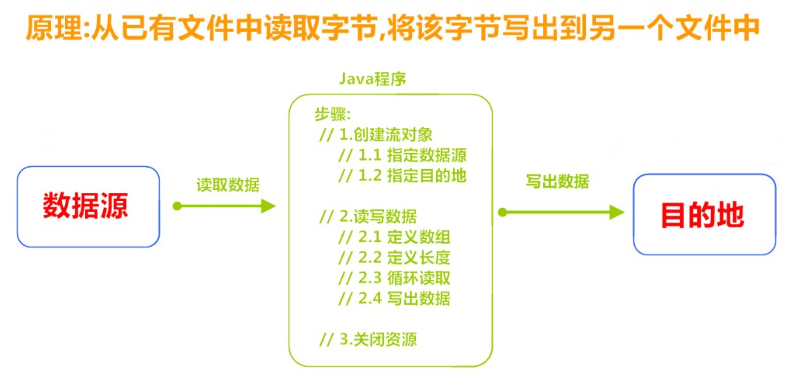

# 第一章 IO概述

## 1.1 IO的分类

根据数据的流向分为：**输入流**和**输出流**。

* **输入流**：把数据从 `其他设备`上读取到 `内存`中的流。
* **输出流**：把数据从 `内存`中写出到 `其他设备`上的流。

根局数据的类型分为：**字节流**和**字符流**。

**字节流**：以字节为单位，读写数据的流。
**字符流**：以字符为单位，读写数据的流。

## 1.2 IO的流向说明图解

* 

## 1.3 顶级父类

|        | 输入流                                  | 输出流                                   |
| ------ | --------------------------------------- | ---------------------------------------- |
| 字节流 | 字节输入流`<br>`**InputStream** | 字节输出流`<br>`**OutputStream** |
| 字符流 | 字符输入流`<br>`**Reader**      | 字符输出流`<br>`**Writer**       |

# 第二章 字节流

## 2.1 字节输出流【OutputStream】

`java.io.OutputStream`抽象类是表示字节输出流的所有类的超类，将指定的字节信息写出到目的地。它定义了字节输出流的基本共性功能方法。

* `public void close()`：关闭此输出流并释放与此流相关联的任何系统资源。
* `public void flush()`：刷新此输出流并强制任何缓冲的输出字节被写出。
* `public void write(byte[] b)`：将 b.length字节从指定的字节数组写入此输出流。
* `public void write(byte[] b, int off, int len)`：从指定的字节数组写入 len字节，从偏移量 off开始输出到此输出流。
* `public abstract void write(int b)`：将指定的字节输出流。

> Tips:
> close方法，当完成流的操作时，必须调用此方法，释放系统资源。

## 2.2 FileOutputStream类

**构造方法：**

* `public FileOutputStream(File file)`：创建文件输出流以写入由指定的 File对象表示的文件。
* `public FileOutputStream(String name)`：创建文件输出流以指定的名称写入文件。

创建一个流对象时，必须传入一个文件路径。该路径下，如果没有这个文件，会创建该文件。如果有这个文件，会清空这个文件的数据。

**示例：**

```java
public class FileOutputStreamDemo01 {

    public static void main(String[] args) throws IOException {

        File file = new File("a.txt");

        //使用File对象创建流对象
        FileOutputStream fos1 = new FileOutputStream(file);

        //使用文件名称创建流对象
        FileOutputStream fos2 = new FileOutputStream("b.txt");

        //写出第一个字节
        fos1.write(97);
        //写出第二个字节
        fos1.write(98);

        // 字符串转换为字节数组
        byte[] b = "无敌无敌".getBytes();

        fos1.write(b);

        byte[] c = "abcde".getBytes();
        //写出从索引2开始，2个字节。索引2是c，两个字节，也就是cd。
        fos1.write(c,2,2);

        //关闭资源
        fos1.close();
        fos2.close();
    }
}
```

## 2.3 数据追加续写

* `public FileOutputStream(File file, boolean append)`：创建文件输出流以写入由指定的File对象表示的文件。
* `public FileOutputStream(String name, boolean append)`：创建文件输出流以指定的名称写入文件。

这两个构造方法，参数中都需要传入一个boolean类型的值，`True`表示追加数据，`false`表示清空原有数据。

**示例：**

```java
public class FileOutputStreamDemo02 {

    public static void main(String[] args) throws IOException {

        //使用文件名称创建流对象
        FileOutputStream fos2 = new FileOutputStream("b.txt",true);

        // 字符串转换为字节数组
        byte[] b = "无敌无敌".getBytes();

        fos2.write(b);

        //关闭资源
        fos2.close();
    }
}
```

## 2.4 换行

```java
public static void main(String[] args) throws IOException {

    //使用文件名称创建流对象
    FileOutputStream fos2 = new FileOutputStream("fos.txt",true);

    // 字符串转换为字节数组
    byte[] words = {97,98,99,100,101};

    for (int i = 0; i < words.length; i++) {
        fos2.write(words[i]);
        fos2.write("\r".getBytes());
    }

    //关闭资源
    fos2.close();
}
```

* 回车符：回到一行的开头(return)。
* 换行符：下一行(newline)。
* 系统中的换行:
  * Windows系统里，每行结尾是 `回车+换行`，即 `\r\n`
  * Unix系统里，每行结尾只有 `换行`，即 `\n`
  * Mac系统里，每行结尾是 `回车`，即 `\r`。从 Mac OS X开始与Linux统一。

## 2.5 字节输入流【InputStream】

`java.io.InputStream`抽象类是表示字节输入流的所有类的超类，可以读取字节信息到内存中。它定义了字节输入流的基本共性功能方法。

* `public void close()`：关闭此输入流并释放与此流相关联的任何系统资源。
* `public abstract int read()`：从输入流读取数据的下一个字节。
* `public int read(byte[] b)`：从输入流中读取一些字节数，并将它们存储到字节数组b中 。

> Tips:
> close方法，当完成流的操作时，必须调用此方法，释放系统资源。

## 2.6 FileInputStream类

`java.io.FileInputStream`类是文件输入流，从文件中读取字节。

**构造方法：**

* `FileInputStream(File file)`：通过打开与实际文件的连接来创建一个FileInputStream，该文件由文件系统中的File对象file命名。
* `FileInputStream(String name)`：通过打开与实际文件的连接来创建一个FileInputStream，该文件由文件系统中的路径名name命名。

> Tips：
> 创建一个流对象时，必须传入一个文件路径。该路径下，如果没有该文件,会抛出 `FileNotFoundException`

```java
public static void main(String[] args) throws IOException {

    //使用文件名创建流对象
    FileInputStream fis = new FileInputStream("/Users/hechong/IdeaProjects/basic_code/a.txt");

    //定义变量，保存数据
//        int a;

    //循环读取数据
//        while ((a=fis.read())!=-1) {
//            System.out.print((char)a);
//        }

    //定义变量，作为有效个数
    int len;
    byte[] bytes = new byte[2];

    while ((len = fis.read(bytes)) != -1) {
        // 每次读取后,把数组的有效字节部分，变成字符串打印
        System.out.print(new String(bytes,0,len));// len 每次读取的有效字节个数
    }

    fis.close();
}
```

> Tips：
> 使用数组读取，每次读取多个字节，减少了系统间的IO操作次数，从而提高了读写的效率

## 2.7 字节流文件复制

**复制文件图解原理**

* 

```java
public class CopyDemo {

    public static void main(String[] args) throws IOException {

        //指定数据源
        FileInputStream fis = new FileInputStream("/Users/hechong/Desktop/test1/a.txt");

        //目的地
        FileOutputStream fos = new FileOutputStream("/Users/hechong/Desktop/test1/test2/a_copy.txt");

        //读写数据
        byte[] bytes = new byte[1024];

        //定义长度
        int len;

        //循环读取
        while ((len=fis.read(bytes))!=-1) {

            //输出数据
            fos.write(bytes,0,len);
        }

        fos.close();
        fis.close();
    }
}
```

> Tips：
> 流的关闭原则:先开后关，后开先关。

# 第三章 字符流

使用字节流读取文本文件时，有一个问题。就是遇到中文字符时，可能不会显示完整的字符，那是因为一个中文字符可能占用多个字节存储。Java提供一些字符流类，以字符为单位读写数据，专门用于处理文本文件。

## 3.1 字符输入流【Reader】

`java.io.Reader`抽象类是表示用于读取字符流的所有类的超类，可以读取字符信息到内存中。它定义了字符输入流的基本共性功能方法。

* `public void close()`：关闭此流并释放与此流相关联的任何系统资源。
* `public int read()`：从输入流读取一个字符，提升为int类型，读取到文件末尾，返回 `-1`。
* `public int read(char[] cbuf)`：从输入流中读取一些字符，并将它们存储到字符数组 cbuf中 。

## 3.2 FileReader类

`java.io.FileReader`类是读取字符文件的便利类。构造时使用系统默认的字符编码和默认字节缓冲区。

> Tips：
>
> 1. 字符编码：字节与字符的对应规则。Windows系统的中文编码默认是GBK编码表。
> 2. 字节缓冲区：一个字节数组，用来临时存储字节数据。

**构造方法：**

* `FileReader(File file)`：创建一个新的FileReader，给定要读取的File对象。
* `FileReader(String fileName)`：创建一个新的FileReader，给定要读取的文件的名称。

**示例：**

```java
public class FileReaderDemo01 {

    public static void main(String[] args) throws IOException {

        //创建流对象
        FileReader fr = new FileReader("a.txt");

        //定义变量，保存数据
//        int len;

//        while ((len = fr.read())!=-1) {
//            System.out.print((char)len);
//        }

        //定义变量，保存有效字符个数
        int len;
        //定义字符数组，作为装字符数据的容器
        char[] cbuf = new char[2];

        while ((len=fr.read(cbuf))!=-1) {
            System.out.print(new String(cbuf,0,len));
        }

        fr.close();
    }
}
```

## 3.3 字符输出流【Writer】

`java.io.Writer`抽象类是表示用于写出字符流的所有类的超类，将指定的字符信息写出到目的地。它定义了字节输出流的基本共性功能方法。

* `void write(int c)`：写入单个字符。
* `void write(char[] cbuf)`：写入字符数组。
* `abstract void write(char[] cbuf, int off, int len)`：写入字符数组的某一部分,off数组的开始索引,len写的字符个数。
* `void write(String str)`：写入字符串。
* `void write(String str, int off, int len)`：写入字符串的某一部分,off字符串的开始索引,len写的字符个数。
* `void flush()`：刷新该流的缓冲。
* `void close()`：关闭此流，但要先刷新它。

## 3.4 FileWriter类

`java.io.FileWriter`类是写出字符到文件的便利类。构造时使用系统默认的字符编码和默认字节缓冲区。

**构造方法：**

* `FileWriter(File file)`：创建一个新的FileWriter，给定要读取的File对象。
* `FileWriter(String fileName)`：创建一个新的FileWriter，给定要读取的文件的名称。

**示例：**

```java
public class FileWriteDemo01 {

    public static void main(String[] args) throws IOException {
        //创建流对象，可以续写数据
        FileWriter fw = new FileWriter("a.txt",true);

        fw.write("你好世界！");

        //换行
        fw.write("\r");

        //字符串转换为字符数组
        char[] chars = "大家好，才是真的好！".toCharArray();

        fw.write(chars);

        //刷新缓冲区
        fw.flush();
        fw.close();
    }
}
```

> Tips:
> 字符流，只能操作文本文件，不能操作图片，视频等非文本文件。

# 第四章 IO异常的处理

**JDK7之前的处理方式**

```java
public static void main(String[] args) {

    FileWriter fw = null;

    try {
        fw = new FileWriter("fw.txt");
        fw.write("测试");
    } catch (IOException e) {
        e.printStackTrace();
    } finally {
        try {
            if (fw != null) {
                fw.close();
            }
        } catch (IOException e) {
            e.printStackTrace();
        }
    }
}
```

**JDK7的处理**

JDK7优化后的 `try-with-resource`语句，该语句确保了每个资源在语句结束时关闭。所谓的资源(resource)是指在程序完成后，必须关闭的对象。

**格式：**

```java
try (创建流对象语句，如果多个,使用';'隔开) { // 读写数据
   } catch (IOException e) {
       e.printStackTrace();
}
```

# 第五章 属性集

`java.util.Properties`继承于 `Hashtable`，来表示一个持久的属性集。它使用键值结构存储数据，每个键及其对应值都是一个字符串。该类也被许多Java类使用，比如获取系统属性时，`System.getProperties`方法就是返回一个 `Properties`对象。

## 5.1 Properties类

**构造方法**

* `public Properties()`：创建一个空的属性列表。

**基本的存储方法**

* `public Object setProperty(String key, String value)`：保存一对属性。
* `public String getProperty(String key)`：使用此属性列表中指定的键搜索属性值。
* `public Set<String> stringPropertyNames()`：所有键的名称的集合。

**示例：**

```java
public class ProDemo {

    public static void main(String[] args) {

        Properties properties = new Properties();

        //添加键值对
        properties.setProperty("name","何少");
        properties.setProperty("age","19");
        properties.setProperty("sex","男");

        System.out.println(properties);

        //通过key，获得value
        System.out.println(properties.getProperty("name"));

        //遍历属性集,获取所有键的集合
        Set<String> strings = properties.stringPropertyNames();

        //打印键值对
        for (String key : strings) {
            System.out.println("key:"+key+"---> value:"+properties.getProperty(key));
        }
    }
}
```

## 5.2 流相关的方法

* `public void store(OutputStream out,String comments)`：把集合中的临时数据，持久化写入到硬盘中，out字节输出流，comments用于解释说明保存的文件的作用，不能使用中文，会产生乱码，一般使用""。
* `public void store(Writer write,String comments)`：把集合中的临时数据，持久化写入到硬盘中，write字符输出流。
* `public void load(InputStream inStream)`：把硬盘中保存的文件（键值对），读到集合中使用，字节输入流。
* `public void load(Reader reader)`：把硬盘中保存的文件（键值对），读到集合中使用，字符输入流。

**示例：**

```java
public class ProDemo {

    public static void main(String[] args) throws IOException {

        Properties properties = new Properties();

        //添加键值对
        properties.setProperty("name","heshao");
        properties.setProperty("age","19");
        properties.setProperty("sex","boy");

        //将键值对保存在文件中
        properties.store(new FileOutputStream("a.txt"),"");

        properties.setProperty("姓名","何少");

        properties.store(new FileWriter("a.txt",true),"");

        Properties properties2 = new Properties();

        //读取保存在文件中的键值对
        properties2.load(new FileReader("a.txt"));

        Set<String> strings = properties2.stringPropertyNames();

        for (String key : strings) {
            System.out.println(key+"="+properties2.getProperty(key));
        }

    }
}
```

> Tips：
> 文本中的数据，必须是键值对形式，可以使用空格、等号、冒号等符号分隔。

# 第六章 缓冲流

缓冲流,也叫高效流，是对4个基本的流 `FileXxx`的增强。

* **字节缓冲流**：`BufferedInputStream`，`BufferedOutputStream`
* **字符缓冲流**：`BufferedReader`，`BufferedWriter`

缓冲流的基本原理，是在创建流对象时，会创建一个内置的默认大小的缓冲区数组，通过缓冲区读写，减少系统IO次数，从而提高读写的效率。

## 6.1 字节缓冲流

**构造方法：**

* `public BufferedInputStream(InputStream in)`：创建一个新的缓冲输入流。
* `public BufferedOutputStream(OutputStream out)`：创建一个新的缓冲输出流。

## 6.2 字符缓冲流

**构造方法：**

* `public BufferedReader(Reader in)`：创建一个 新的缓冲输入流。
* `public BufferedWriter(Writer out)`：创建一个新的缓冲输出流。

**特有方法：**

* BufferedReader：`public String readLine()`：读一行文字。
* BufferedWriter：`public void newLine()`：写一行行分隔符,由系统属性定义符号。

**示例：**

```java
public static void main(String[] args) throws IOException {

    InputStreamReader isr = new InputStreamReader(new FileInputStream("fw.txt"),"GBK");

    BufferedReader brs = new BufferedReader(new FileReader("fw.txt"));

    // 定义字符串,保存读取的一行文字
    String line = null;

    // 循环读取,读取到最后返回null
    while ((line = brs.readLine())!=null) {
        System.out.print(line);
    }

    brs.close();
}
```

# 第七章 转换流

## 7.1 InputStreamReader类

`java.io.InputStreamReader`，是Reader的子类，是从字节流到字符流的桥梁。它读取字节，并使用指定的字符集将其解码为字符。它的字符集可以由名称指定，也可以接受平台的默认字符集。

**构造方法：**

* `InputStreamReader(InputStream in)`：创建一个使用默认字符集的字符流。
* `InputStreamReader(InputStream in, String charsetName)`：创建一个指定字符集的字符流。

**示例：**

```java
public static void main(String[] args) throws IOException {

    InputStreamReader isr = new InputStreamReader(new FileInputStream("fw.txt"),"GBK");

    //定义变量,保存字符
    int len;

    // 循环读取,读取到最后返回null
    while ((len = isr.read())!=-1) {
        System.out.print((char)len);
    }

    isr.close();
}
```

## 7.2 OutputStreamWriter类

`java.io.OutputStreamWriter`是Writer的子类，是从字符流到字节流的桥梁。使用指定的字符集,将字符编码为字节。它的字符集可以由名称指定，也可以接受平台的默认字符集。

**构造方法：**

* `OutputStreamWriter(OutputStream in)`：创建一个使用默认字符集的字符流。
* `OutputStreamWriter(OutputStream in, String charsetName)`：创建一个指定字符集的字符流。

**示例：**

```java
public static void main(String[] args) throws IOException {

    //创建流对象,指定GBK编码
    OutputStreamWriter osw = new OutputStreamWriter(new FileOutputStream("b.txt"),"GBK");

    osw.write("你好骚啊！");

    osw.close();
}
```

**转换流图解**

* 

# 第八章 序列化

Java提供了一种对象**序列化**的机制。用一个字节序列可以表示一个对象，该字节序列包含该 `对象的数据`，`对象的类型`，和 `对象中存储的属性`等信息。字节序列写出到文件之后，相当于文件中**持久保存**了一个对象的信息。
反之，该字节序列还可以从文件中读取回来，重构对象，对它进行**反序列化**。`对象的数据`，`对象的类型`，和 `对象中存储的属性`信息，都可以用来在内存中创建对象

* 

## 8.1 ObjectOutputStream类

`java.io.ObjectOutputStream`类，将Java对象的原始数据类型写出到文件,实现对象的持久存储。

**构造方法：**

* `public ObjectOutputStream(OutputStream out)`：创建一个指定OutputStream的ObjectOutputStream。

**序列化操作**

1. 一个对象要想序列化，必须满足两个条件:

* 该类必须实现 `java.io.Serializable`操作，`Serializable`是一个标记接口，不实现此接口的类将不会使任何状态序列化或反序列化，会抛出 `NotSerializableException`。
* 该类的所有属性必须是可序列化的。如果有一个属性不需要可序列化的，则该属性必须注明是瞬态的，使用 `transient`关键字修饰。

**写出对象方法：**

* `public final void writeObject (Object obj)`：将指定的对象写出。

**示例：**

```java
public class Person implements Serializable {

    public String name;
    public String sex;
    //transient瞬态修饰成员,不会被序列化
    public transient int age;

    public Person(String name, String sex, int age) {
        this.name = name;
        this.sex = sex;
        this.age = age;
    }

    public String getName() {
        return name;
    }

    public void setName(String name) {
        this.name = name;
    }

    public String getSex() {
        return sex;
    }

    public void setSex(String sex) {
        this.sex = sex;
    }

    public int getAge() {
        return age;
    }

    public void setAge(int age) {
        this.age = age;
    }
}
```

```java
public static void main(String[] args) throws IOException {

    ObjectOutputStream oos = new ObjectOutputStream(new FileOutputStream("fw.txt"));

    //写出对象
    oos.writeObject(new Person("heshao","boy",18));

    oos.close();
}
```

## 8.2 ObjectInputStream类

ObjectInputStream反序列化流，将之前使用ObjectOutputStream序列化的原始数据恢复为对象。

**构造方法：**

* `public ObjectInputStream(InputStream in)`：创建一个指定InputStream的ObjectInputStream。

**读出对象方法：**

* `public final Object readObject ()`：读取一个对象。

**示例：**

```java
public static void main(String[] args) throws IOException, ClassNotFoundException {

    ObjectInputStream ois = new ObjectInputStream(new FileInputStream("fw.txt"));

    //读取一个对象
    Person p = (Person)ois.readObject();

    System.out.println("name:"+p.name+"sex:"+p.sex);
}
```

> Tips:
> 对于JVM可以反序列化对象，它必须是能够找到class文件的类。如果找不到该类的class文件，则抛出一个 `ClassNotFoundException`异常。

另外，当JVM反序列化对象时，能找到class文件，但是class文件在序列化对象之后发生了修改，那么反序列化操作也会失败，抛出一个 `InvalidClassException`异常。

**造成原因：**

* 该类的序列版本号与从流中读取的类描述符的版本号不匹配
* 该类包含未知数据类型
* 该类没有可访问的无参数构造方法

`Serializable`接口给需要序列化的类，提供了一个序列版本号。`serialVersionUID`该版本号的目的在于验证序列化的对象和对应类是否版本匹配。

```java
// 加入序列版本号
private static final long serialVersionUID = 1L;
```

# 第九章 打印流

`print`和 `println`这两个方法都来自于 `java.io.PrintStream`类，继承自 `FilterOutputStream`，该类能够方便地打印各种数据类型的值，是一种便捷的输出方式。

## 9.1 PrintStream类

**构造方法：**

* `public PrintStream(String fileName)`：使用指定的文件名创建一个新的打印流。

**改变打印流向**

`System.out`就是 `PrintStream`类型的，只不过它的流向是系统规定的，打印在控制台上。流对象，我们可以自己修改他的流向。

**示例：**

```java
public static void main(String[] args) throws FileNotFoundException {

    PrintStream ps = new PrintStream("fw.txt");

    ps.print("你好，世界！");

    //改变流向
    System.setOut(ps);

    //会打印的到fw.txt文件中
    System.out.println("加油啊兄弟！");

        ps.close();
}
```
