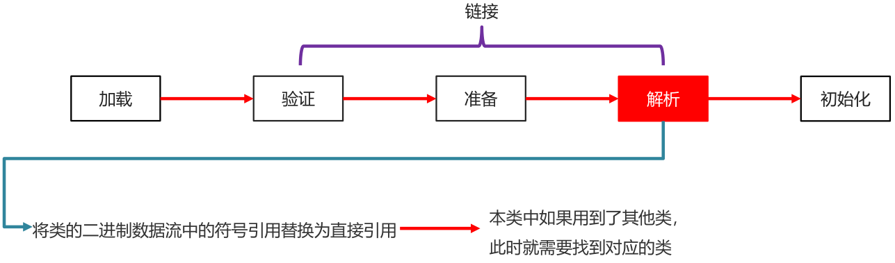
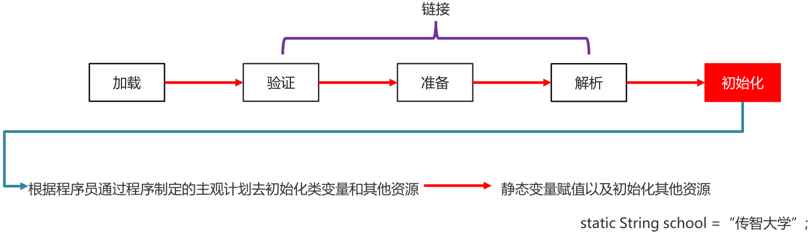

# 第一章 类加载器

**类加载器**负责将.class文件(存储的物理文件)加载在到内存中


## 1.1 类加载的过程

* 类加载时机
	* 创建类的实例(对象)
	* 调用类的类方法
	* 访问类或者接口的类变量，或者为该类变量赋值
	* 使用反射方式来强制创建某个类或接口对应的java.lang.Class对象
	* 初始化某个类的子类
	* 直接使用java.exe命令来运行某个主类

* 类加载过程

	* 加载
		* 通过包名 + 类名，获取这个类，准备用流进行传输
		* 在这个类加载到内存中
		* 加载完毕创建一个class对象

	

	* 链接

		* 验证
			确保Class文件字节流中包含的信息符合当前虚拟机的要求，并且不会危害虚拟机自身安全 (文件中的信息是否符合虚拟机规范有没有安全隐患)

		

		* 准备
			负责为类的类变量(被static修饰的变量)分配内存，并设置默认初始化值(初始化静态变量)

		

		* 解析
			将类的二进制数据流中的符号引用替换为直接引用
			(本类中如果用到了其他类，此时就需要找到对应的类)

		

	* 初始化
		根据程序员通过程序制定的主观计划去初始化类变量和其他资源
		(静态变量赋值以及初始化其他资源)

	

	**总结：**

	* 当一个类被使用的时候，才会加载到内存
	* 类加载的过程: 加载、验证、准备、解析、初始

## 1.2 类加载的分类

* 分类
	* Bootstrap class loader：虚拟机的内置类加载器，通常表示为null ，并且没有父null
	* Platform class loader：平台类加载器,负责加载JDK中一些特殊的模块
	* System class loader：系统类加载器,负责加载用户类路径上所指定的类库
* 类加载器的继承关系
	* System的父加载器为Platform
	* Platform的父加载器为Bootstrap

## 1.3 双亲委派模型

如果一个类加载器收到了类加载请求，它并不会自己先去加载，而是把这个请求委托给父类的加载器去执行，如果父类加载器还存在其父类加载器，则进一步向上委托，依次递归，请求最终将到达顶层的启动类加载器，如果父类加载器可以完成类加载任务，就成功返回，倘若父类加载器无法完成此加载任务，子加载器才会尝试自己去加载，这就是双亲委派模式


## 1.5 ClassLoader 中的两个方法

* `public static ClassLoader getSystemClassLoader()`：获取系统类加载器
* `public InputStream getResourceAsStream(String name)`：加载某一个资源文件

**示例：**

```java
public class ClassLoaderDemo1 {

    public static void main(String[] args) throws IOException {

        // 获取系统类加载器
        ClassLoader systemClassLoader = ClassLoader.getSystemClassLoader();

        // 利用加载器去加载一个指定的文件
        // 参数:文件的路径(放在src的根目录下，默认去那里加载)
        // 返回值:字节流
        InputStream is = systemClassLoader.getResourceAsStream("prop.properties");

        Properties properties = new Properties();

        properties.load(is);

        System.out.println(properties);

        is.close();
    }
}
```

# 第二章 反射

## 2.1 概述

反射机制，是在运行状态中，对于任意一个类，都能够知道这个类的所有属性和方法; 对于任意一个对象，都能够调用它的任意属性和方法; 这种动态获取信息以及动态调用对象方法的功能称为Java语言的反射机制。

## 2.2 获取Class类对象的三种方式

* 类名.class属性
* 对象名.getClass()方法
* Class.forName(全类名)方法


**示例：**

```java
package com.th.demo02;

import com.sun.org.apache.xml.internal.security.keys.keyresolver.implementations.PrivateKeyResolver;

/**
 * @author Hecker
 * @version 1.0
 * @date 2022/5/1 18:57
 * @description TODO
 */
public class Student {

    private String name;
    private int age;
    public String sex;

    private Student(String name) {
        System.out.println("private...Student...有参构造方法");
    }

    public Student() {
    }

    public Student(String name, int age) {
        this.name = name;
        this.age = age;
    }

    public void function(String name) {
        System.out.println(name);
    }

    public String getName() {
        return name;
    }

    public void setName(String name) {
        this.name = name;
    }

    public int getAge() {
        return age;
    }

    public void setAge(int age) {
        this.age = age;
    }

    @Override
    public String toString() {
        return "Student{" +
                "name='" + name + '\'' +
                ", age=" + age +
                '}';
    }
}

```

## 2.2 Class类获取构造方法对象

**相关方法**

* `public Constructor<?>[] getConstructors()`：返回所有公共构造方法对象的数组。
* `public Constructor<?>[] getDeclaredConstructors()`：返回所有构造方法对象的数组。
* `public Constructor getConstructor(Class<?>... parameterTypes)`：返回单个公共构造方法对象。
* `public Constructor getDeclaredConstructor(Class<?>... parameterTypes)`：返回单个构造方法对象。

**示例：**

```java
public class ReflexDemo02 {

    public static void main(String[] args) throws NoSuchMethodException {

        // 获取class类对象
        Class<Student> studentClass = Student.class;

        constructors(studentClass);

        constructorAll(studentClass);

        constructor(studentClass);

        declaredConstructor(studentClass);
    }

    private static void constructors(Class<Student> studentClass) {
        // 获取所有的公共构造方法
        Constructor<?>[] constructors = studentClass.getConstructors();
        for (Constructor<?> constructor : constructors) {
            System.out.println(constructor);
        }
        System.out.println("================================");
    }

    private static void constructorAll(Class<Student> studentClass) {
        // 获取所有的构造方法
        Constructor<?>[] declaredConstructors = studentClass.getDeclaredConstructors();
        for (Constructor<?> declaredConstructor : declaredConstructors) {
            System.out.println(declaredConstructor);
        }
        System.out.println("================================");
    }

    private static void constructor(Class<Student> studentClass) throws NoSuchMethodException {
        // 获取单个公共构造方法
        // 小括号中，一定要跟构造方法的形参保持一致
        Constructor<Student> constructor1 = studentClass.getConstructor();
        System.out.println(constructor1);
        Constructor<Student> constructor2 = studentClass.getConstructor(String.class,int.class);
        System.out.println(constructor2);
        System.out.println("================================");
    }

    private static void declaredConstructor(Class<Student> studentClass) throws NoSuchMethodException {
        // 获取单个构造方法
        Constructor<Student> declaredConstructor = studentClass.getDeclaredConstructor(String.class);
        System.out.println(declaredConstructor);
    }
}
```

## 2.3 Constructor类用于创建对象

**相关方法**

* `T newInstance(Object...initargs)`：根据指定的构造方法创建对象。
* `setAccessible(boolean flag)`：设置为true,表示取消访问检查。

```java
public class ReflexDemo03 {

    public static void main(String[] args) throws InstantiationException, IllegalAccessException, NoSuchMethodException, InvocationTargetException {

        // 获取class类对象
        Class<Student> studentClass = Student.class;

        newinstanceDemo(studentClass);

        newinstanceDemo02(studentClass);
    }

    private static void newinstanceDemo02(Class<Student> studentClass) throws NoSuchMethodException, InstantiationException, IllegalAccessException, InvocationTargetException {
        Constructor<Student> declaredConstructor = studentClass.getDeclaredConstructor(String.class);
        // 被private修饰的成员，不能直接使用，反射强行使用，需要取消访问检查
        declaredConstructor.setAccessible(true);
        Student lisi = declaredConstructor.newInstance("李四");
        System.out.println(lisi);
    }

    private static void newinstanceDemo(Class<Student> studentClass) throws NoSuchMethodException, InstantiationException, IllegalAccessException, InvocationTargetException {
        // 公共的有参构造
        Constructor<Student> declaredConstructor = studentClass.getDeclaredConstructor(String.class,int.class);
        // 创建对象
        Student student = (Student) declaredConstructor.newInstance("张三",18);
        System.out.println(student);
    }
}
```

## 2.4 反射获取成员变量

**相关方法**

* `Field[] getFields()`：返回所有公共成员变量对象的数组
* `Field[] getDeclaredFields()`：返回所有成员变量对象的数组
* `Field getField(String name)`：返回单个公共成员变量对象
* `Field getDeclaredField(String name)`：返回单个成员变量对象

```java
public class ReflexDemo04 {

    public static void main(String[] args) throws NoSuchFieldException {

        // 获取class对象
        Class<Student> studentClass = Student.class;

        // fieles(studentClass);
        //
        // declaredfieles(studentClass);

        declaredfiele(studentClass);
        fiele(studentClass);
    }

    private static void fiele(Class<Student> studentClass) throws NoSuchFieldException {
        // 获取单个公共成员变量
        Field name = studentClass.getField("sex");
        System.out.println(name);
    }

    private static void declaredfiele(Class<Student> studentClass) throws NoSuchFieldException {
        // 获取单个公共成员变量
        Field name = studentClass.getDeclaredField("name");
        System.out.println(name);
    }

    private static void declaredfieles(Class<Student> studentClass) {
        // 获取所有的成员变量
        Field[] declaredFields = studentClass.getDeclaredFields();
        for (Field declaredField : declaredFields) {
            System.out.println(declaredField);
        }
    }

    private static void fieles(Class<Student> studentClass) {
        // 获取公共的所有成员变量
        Field[] field = studentClass.getFields();

        for (Field field1 : field) {
            System.out.println(field1);
        }
    }
}
```

## 2.5 Field类用于给成员变量赋值

**相关方法**

* `void set(Object obj, Object value)`：赋值
* `Object get(Object obj)`：获取值

```java
public class ReflexDemo05 {
    public static void main(String[] args) throws InstantiationException, IllegalAccessException, NoSuchFieldException {

        Class<Student> studentClass = Student.class;

        Field declaredField = studentClass.getDeclaredField("name");

        // 取消访问检查，创建对象
        declaredField.setAccessible(true);
        Student student = studentClass.newInstance();

        // 赋值
        declaredField.set(student, "张三");
        // 获取值
        System.out.println(declaredField.get(student));

    }
}
```

## 2.6 Class类获取成员方法

**相关方法**

* `Method[] getMethods()`：返回所有公共成员方法对象的数组，包括继承的。
* `Method[] getDeclaredMethods()`：返回所有成员方法对象的数组，不包括包括继承的。
* `Method getMethod(String name, Class<?>...parameterTypes)`：返回单个公共成员方法对象。
* `Method getDeclaredMethod(String name, Class<?>...parameterTypes)`：返回单个成员方法对象。

```java
public class ReflexDemo06 {

    public static void main(String[] args) throws NoSuchMethodException {

        Class<Student> studentClass = Student.class;

        methods(studentClass);

        declaredMethods(studentClass);

        method(studentClass);
    }

    private static void method(Class<Student> studentClass) throws NoSuchMethodException {
        // 获取单个公共方法
        Method student = studentClass.getMethod("toString");
        System.out.println(student);
    }

    private static void declaredMethods(Class<Student> studentClass) {
        // 获取所有的成员方法，不包括继承
        Method[] declaredMethods = studentClass.getDeclaredMethods();
        for (Method declaredMethod : declaredMethods) {
            System.out.println(declaredMethod);
        }
    }

    private static void methods(Class<Student> studentClass) {
        // 获取所有的公共成员方法，包括继承
        Method[] methods = studentClass.getMethods();
        for (Method method : methods) {
            System.out.println(method);
        }
    }
}
```

## 2.7 Method类用于执行方法

**相关方法**

* `Object invoke(Object obj, Object... args)`：运行方法
	* 参数一：用obj对象调用该方法
	* 参数二：调用方法的传递的参数(如果没有就不写)
	* 参数三：方法的返回值(如果没有就不写)

**示例：**

```java
public class ReflexDemo07 {

    public static void main(String[] args) throws NoSuchMethodException, InstantiationException, IllegalAccessException, InvocationTargetException {

        Class<Student> studentClass = Student.class;

        Method methode = studentClass.getMethod("function",String.class);
        Student student = studentClass.newInstance();

        methode.invoke(student, "张三");
    }

}
```


