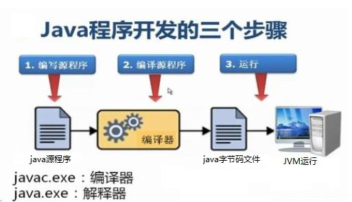
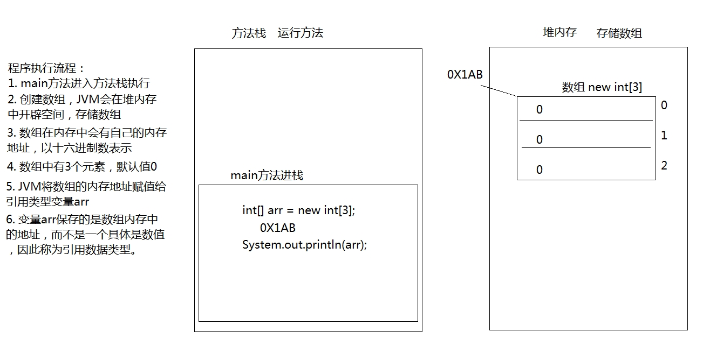
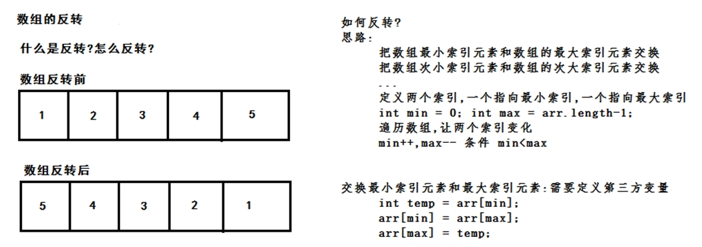

[TOC]
# 第一章 开发前言

## JAVA运行环境

## 1.1 Java语言概述

### 什么是Java语言

Java语言是美国Sun公司（Stanford University Network），在1995年推出的高级的编程语言。所谓编程语言，是 计算机的语言，人们可以使用编程语言对计算机下达命令，让计算机完成人们需要的功能。

### Java语言发展历史

* 1995年Sun公司发布Java1.0版本 
* 1997年发布Java 1.1版本 
* 1998年发布Java 1.2版本 
* 2000年发布Java 1.3版本 
* 2002年发布Java 1.4版本 
* 2004年发布Java 1.5版本
* 2006年发布Java 1.6版本
* 2009年Oracle甲骨文公司收购Sun公司，并于2011发布Java 1.7版本
* 2014年发布Java 1.8版本 
* 2017年发布Java 9.0版本

### Java语言能做什么

Java语言主要应用在互联网程序的开发领域。常见的互联网程序比如天猫、京东、物流系统、网银系统等，以及服 务器后台处理大数据的存储、查询、数据挖掘等也有很多应用。

## 1.2 计算机基础知识

### 二进制

计算机中的数据不同于人们生活中的数据，人们生活采用十进制数，而计算机中全部采用二进制数表示，它只包含 0、1两个数，逢二进一，1+1=10。每一个0或者每一个1，叫做一个bit（比特）。

* **十进制数据转成二进制数据：** 使用除以2获取余数的方式
- 


* **二进制数据转成十进制数据：** 使用8421编码的方式
- 

> Tips:二进制数系统中，每个0或1就是一个位，叫做bit（比特）

### 字节
字节是我们常见的计算机中最小存储单元。计算机存储任何的数据，都是以字节的形式存储，右键点击文件属性， 我们可以查看文件的字节大小。
8个bit（二进制位） 0000-0000表示为1个字节，写成`1byte`或者`1B`。

- 8 bit = 1 B
- 1024 B =1 KB
- 1024 KB =1 MB 1024 MB =1 GB
- 1024 GB = 1 TB

### 常用的DOS命令

| 命令             | 操作符号    |
| ---------------- | ----------- |
| 盘符切换命令     | 盘符名:     |
| 查看当前文件夹   | dir         |
| 进入文件夹命令   | cd 文件夹名 |
| 退出文件夹命令   | cd ..       |
| 退出到磁盘根目录 | cd \        |
| 清屏             | cls         |

# 第二章 Java语言环境搭建

## 2.1 Java虚拟机——JVM

- JVM（Java Virtual Machine ）：Java虚拟机，简称JVM，是运行所有Java程序的假想计算机，是Java程序的 运行环境，是Java 最具吸引力的特性之一。我们编写的Java代码，都运行在 JVM 之上。 
- 跨平台：任何软件的运行，都必须要运行在操作系统之上，而我们用Java编写的软件可以运行在任何的操作系 统上，这个特性称为Java语言的跨平台特性。该特性是由JVM实现的，我们编写的程序运行在JVM上，而JVM 运行在操作系统上
- 

> 如图所示，Java的虚拟机本身不具备跨平台功能的，每个操作系统下都有不同版本的虚拟机。

## 2.2 JRE 和 JDK

* **JRE (Java Runtime Environment) ：** 是Java程序的运行时环境，包含 JVM 和运行时所需要的 核心类库 。 
* **JDK (Java Development Kit)：** 是Java程序开发工具包，包含 JRE 和开发人员使用的工具。
运行一个已有的Java程序只需要安装JRE，想要开发一个全新的Java程序必须安装JDK。
- 

# 第三章 HelloWorld程序入门

## 3.1 程序开发步骤说明
Java程序开发三步骤：编写、编译、运行。
- 
```java
public class HelloWorld { 
    public static void main(String[] args) { 
        System.out.println("Hello World!");
    } 
}
```
> 文件名必须是 HelloWorld ，保证文件名和类的名字是一致的，注意大小写。 每个字母和符号必须与示例代码一模一样。编写完代码，接下来就是编译,编译成功后，产生了一个新的文件 HelloWorld.class ，该文件 就是编译后的文件，是Java的可运行文件，称为字节码文件，有了字节码文件，就可以运行程序了。

## 3.2 入门程序说明

### 编译和运行时两回事

* 编译：是指将我们编写的Java源文件翻译成JVM认识的class文件，在这个过程中， javac编译器会检查我们所写的程序是否有错误，有错误就会提示出来，如果没有错误就会编译成功。 
* 运行：是指将 class文件交给JVM去运行，此时JVM就会去执行我们编写的程序了。

###  关于main方法

* main方法：称为主方法。写法是固定格式不可以更改。main方法是程序的入口点或起始点，无论我们编写多 少程序，JVM在运行的时候，都会从main方法这里开始执行。

## 3.3 添加注释comment

* **注释：** 就是对代码的解释和说明。其目的是让人们能够更加轻松地了解代码。为代码添加注释，是十分必须 要的，它不影响程序的编译和运行。 
* Java 中有单行注释和多行注释
    * 单行注释以 &#47;&#47;开头 换行结束 
    * 多行注释以 &#47;&#42;开头 以&#42;&#47;结束

## 3.4 关键字keywords

* **关键字：** 是指在程序中，Java已经定义好的单词，具有特殊含义。
    * HelloWorld案例中，出现的关键字有 public 、 class 、 static、void等，这些单词已经被Java定义好，全部都是小写字母，notepad++中颜色特殊。

## 3.5 标识符

* **标识符 ：** 是指在程序中，我们自己定义内容。比如类的名字、方法的名字和变量的名字等等，都是标识符。
    * HelloWorld 案例中，出现的标识符有类名字 HelloWorld 。

* **命名规则：**
    * 标识符可以包含`英文字母26个(区分大小写)`、`0-9数字`、`$（美元符号）`和`_(下划线）`。
    * 标识符不能以数字开头。 
    * 标识符不能是关键字。
* **命名规规范：**
    * 类名规范：首字母大写，后面每个单词首字母大写（大驼峰式）。 
    * 方法名规范：首字母小写，后面每个单词首字母大写（小驼峰式）。 
    * 变量名规范：全部小写。

# 第四章 常量

## 4.1 常量的概述

**常量：** 是Java程序中固定不变的数据。

## 4.2 分类

| 类型       | 含义                                   | 数据举例                 |
| ---------- | -------------------------------------- | ------------------------ |
| 整数常量   | 所有的整数                             | 0，1，567，-9            |
| 小数常量   | 所有的小数                             | 0.0，-0.1，2.55          |
| 字符常量   | 单引号引起来,只能写一个字符,必须有内容 | 'a'，' '，'好'           |
| 字符串常量 | 双引号引起来,可以写多个字符,也可以不写 | "A"，"Hello"，"你好"，"" |
| 布尔常量   | 只有两个值                             | true，false              |
| 空常量     | 只有一个值                             | null                     |

# 第五章 变量和数据类型

## 5.1 变量的概述

**变量：** 常量是固定不变的数据，那么在程序中可以变化的量称为变量。
> Tips: Java中要求一个变量每次只能保存一个数据，必须要明确保存的数据类型。

## 5.2 数据类型

**Java的数据类型分为两大类：**
* **基本数据类型：** `整数`、`浮点数`、`字符`、`布尔`
* **引用数据类型：** `类`、`数组`、`接口`

基本数据类型

| 数据类型     | 关键字         | 内存占用 | 取值范围               |
| ------------ | -------------- | -------- | ---------------------- |
| 字节型       | byte           | 1个字节  | -128~127               |
| 短整型       | short          | 2个字节  | -32768~32767           |
| 整型         | int（默认）    | 4个字节  | -231次方~2的31次方-1   |
| 长整型       | long           | 8个字节  | -2的63次方~2的63次方-1 |
| 单精度浮点数 | float          | 4个字节  | 1.4013E-45~3.4028E+38  |
| 双精度浮点数 | double（默认） | 8个字节  | 4.9E-324~1.7977E+308   |
| 字符型       | char           | 2个字节  | 0-65535                |
| 布尔类型     | boolean        | 1个字节  | true，false            |

> Java中的默认类型：整数类型是`int`、浮点类型是`double`。

## 5.3 变量的定义

**变量定义的格式包括三个要素：** `数据类型`,`变量名`,`数据值`

**格式：**
> 数据类型 变量名 = 数据值;

> Tisp:
> 变量名称：在同一个大括号范围内，变量的名字不可以相同。
> 变量赋值：定义的变量，不赋值不能使用。

## 5.4 数据类型的转换

**自动转换：** 将取值范围小的类型自动提升为取值范围大的类型。

**转换规则：** 范围小的类型向范围大的类型提升，`byte`、`short`、`char`，运算时直接提升为`int`。

> `byte、short、char‐‐>int‐‐>long‐‐>float‐‐>double`

**强制类型转换：** 将`取值范围大的类型`强制转换成`取值范围小的类型`。

**转换格式：** 
> 数据类型 变量名 = （数据类型）被转数据值；

> Tips:
> * 浮点转成整数，直接取消小数点，可能造成数据损失精度。
> * `int`强制转成`short`砍掉2个字节，可能造成数据丢失。

## 5.5 ASCII编码表

**编码表 ：** 就是将人类的文字和一个十进制数进行对应起来组成一张表格。

> Tips: 
> 在char类型和int类型计算的过程中，char类型的字符先查询编码表，得到对应的数字,再和int类型的变量求和。char类型提升为了int类型。char类型内存2个字节，int类型内存4个字节。

# 第六章 运算符

## 6.1 算术运算符

| 算术运算符包括 | 说明                         |
| -------------- | ---------------------------- |
| +              | 加法运算符，字符串连接运算   |
| -              | 减法运算                     |
| *              | 乘法运算                     |
| /              | 触发运算                     |
| %              | 取模运算，两个数字相除取余数 |
| ++，--         | 自增自减运算                 |

> Tips:
> Java中，整数使用以上运算符，无论怎么计算，也不会得到小数。
> `+`符号在遇到字符串的时候，表示连接、拼接的含义。

* **++运算**，变量自增1，**--运算**，变量自减1
  * 独立运算：变量在独立运算时， `前++`和`后++`没有区别 。
  * 混合运算：变量`前++`**，先赋值后运算**；`后++`，**先运算后赋值**。

**前++**
```java
public static void main(String[] args) {

    int i = 1;
    int j = ++i+2;

    System.out.println(i+","+j);//i=2,j=4
}
```

**后++**
```java
public static void main(String[] args) {

    int i = 1;
    int j = 2+i++;

    System.out.println(i+","+j);//i=2,j=3
}
```

## 6.2 赋值运算符

| 赋值运算符包括 | 说明     |
| -------------- | -------- |
| =              | 等于号   |
| +=             | 加等于   |
| -=             | 减等于   |
| *=             | 乘等于   |
| /=             | 除等于   |
| %=             | 取模等于 |

* **赋值运算符:** 就是将符号右边的值，赋给左边的变量。

```java
public static void main(String[] args){ 

    int i = 5; 
    i+=5;//计算方式 i=i+5 变量i先加5，再赋值变量i 

    System.out.println(i); //输出结果是10 
}
```

## 6.3 比较运算符

| 比较运算符包括 | 说明                                                               |
| -------------- | ------------------------------------------------------------------ |
| ==             | 比较符号两边数据是否相等，相等结果是true。                         |
| >              | 比较符号左边的数据是否小于右边的数据，如果小于结果是true。         |
| <              | 比较符号左边的数据是否大于右边的数据，如果大于结果是true。         |
| <=             | 比较符号左边的数据是否小于或者等于右边的数据，如果小于结果是true。 |
| >=             | 比较符号左边的数据是否大于或者等于右边的数据，如果小于结果是true。 |
| !=             | 不等于符号 ，如果符号两边的数据不相等，结果是true。                |

* **比较运算符:** 是两个数据之间进行比较的运算，运算结果都是布尔值`true`或`false。`

```java
public static void main(String[] args) {

    System.out.println(1 == 1);//true 
    System.out.println(1 < 2);//true 
    System.out.println(3 > 4);//false 
    System.out.println(3 <= 4);//true 
    System.out.println(3 >= 4);//false 
    System.out.println(3 != 4);//true

    }
```

## 6.4 逻辑运算符

| 逻辑运算符包括 | 说明                                                                                     |
| -------------- | ---------------------------------------------------------------------------------------- |
| &&短路与       | 两边是true，结果是true<br>一边是false，结果是false<br>特点：左边是false，右边不再计算    |
| \|\|短路或     | 两边是false，结果是false<br>一边是true，结果是true<br>特点：符号左边是true，右边不再运算 |
| !              | 取反                                                                                     |

**逻辑运算符：** 是用来连接两个布尔类型结果的运算符，运算结果都是布尔值`true`或`false`。

## 6.5 三元运算符

* **三元运算符格式：**
> 数据类型 变量名 = 布尔类型表达式？结果1：结果2
* **三元运算符计算方式：**
  * 布尔类型表达式结果是true，三元运算符整体结果为结果1，赋值给变量。
  * 布尔类型表达式结果是false，三元运算符整体结果为结果2，赋值给变量。

```java
public static void main(String[] args) {

    int i =(1==2?100:200);

    System.out.println(i);//200
}
```

# 第七章 方法一

* **方法：** 就是将一个**功能**抽取出来，把代码单独定义在一个大括号内，形成一个单独的功能。

## 7.1方法的定义

* **定义的格式**
```java
修饰符  返回值类型 方法名(参数列表) {
    代码...
    return;
}
```
> Tips: 
> return：方法结束。因为返回值类型是void，方法大括号内的return可以不写。

## 7.2 方法的调用
方法在定义完毕后，方法不会自己运行，必须被调用才能执行，可以在主方法main中来调用我们自己定义好的方法。在主方法中，直接写要调用的方法名字就可以调用了。

```java
public static void main(String[] args) {
    //调用定义的方法method
    method();
}
//定义方法，被main方法调用
public static void method() {
    System.out.println("自己定义的方法，需要被main调用运行");
}
```

# 第八章 流程控制语句

## 8.1 判断语句

* **if语句第一种格式：if**

```java 
if(关系表达式) {
    语句体;
}
```

* 执行流程
> 首先判断关系表达式看其结果是true还是false
> 如果是true就执行语句体
> 如果是false就不执行语句体

- 

* **if的第二种格式：if...else**

```java 
if(关系表达式) {
    语句体1;
}else() {
    语句体2;
}
```

* 执行流程
> 首先判断关系表达式看其结果是true还是false
> 如果是true就执行语句体1
> 如果是false就执行语句体2

- 

* **if的第三种格式：if..else if...else**

```java 
if(判断条件1) {
    语句体1;
}else if(判断条件2) {
    语句体2;
}
...
else if(判断条件n) {
    语句体n;
}else{
    语句体n+1;
}
```

* 执行流程
> 首先判断关系表达式1看其结果是true还是false 
> 如果是true就执行语句体1 
> 如果是false就继续判断关系表达式2看其结果是true还是false 
> 如果是true就执行语句体2 
> 如果是false就继续判断关系表达式…看其结果是true还是false
> …
> 如果没有任何关系表达式为true，就执行语句体n+1。

- 

* **if语句和三元运算符的互换**

在某些简单的应用中，if语句是可以和三元运算符互换使用的。

```java
public static void main(String[] args) {

    int a = 10;
    int b = 20;

    //定义变量，保存a和b的较大值
    int c; 
    if(a > b) {
        c = a;
    } else {
        c = b;
    } 
    //可以上述功能改写为三元运算符形式
    c = a > b ? a:b;
}
```

## 8.2 选择语句

* **switch语句格式：**

```java
switch(表达式) {
    case 常量值1:
        语句体1;
        break;
    case 常量值2:
        语句体2;
        break;
    ...
    default:
        语句体n+1;
        break;
}
```

* **执行流程**
    * 首先计算出表达式的值
    * 其次，和case依次比较，一旦有对应的值，就会执行相应的语句，在执行的过程中，遇到break就会结束
    * 最后，如果所有的case都和表达式的值不匹配，就会执行default语句体部分，然后程序结束掉

- 

* **case的穿透性**

在switch语句中，如果case的后面不写break，将出现穿透现象，也就是不会在判断下一个case的值，直接向后运 行，直到遇到break，或者整体switch结束。

```java
public static void main(String[] args) {

    int i = 5;

    switch (i) {

        case 0:
            System.out.println("执行case0");
            break;

        case 5:
            System.out.println("执行case5");

        case 10:
            System.out.println("执行case10");

        default:
            System.out.println("执行default");
    }

}
```

> Tips:
> 上述程序中，执行case5后，由于没有break语句，程序会一直向后走，不会在判断case，也不会理会break，直接运行完整体switch。
由于case存在穿透性，因此初学者在编写switch语句时，必须要写上break。

## 8.3 循环语句

### 8.3.1 循环语句--for

* **for循环语句格式：**

```java
for(初始化表达式;布尔表达式;步进表达式) {
    循环体;
}
```

* 执行流程
  * 执行顺序：①②③④>②③④>②③④…②不满足为止。
  * ①负责完成循环变量初始化
  * ②负责判断是否满足循环条件，不满足则跳出循环
  * ③具体执行的语句
  * ④循环后，循环条件所涉及变量的变化情况

* **计算1-100之间的偶数和**

```java
public static void main(String[] args) {

    //1.定义一个初始化变量,记录累加求和,初始值为0
    int sum = 0;
    //2.利用for循环获取1‐100之间的数字
    for (int i = 1; i <= 100; i++) {
        //3.判断获取的数组是奇数还是偶数
        if(i % 2==0){
            //4.如果是偶数就累加求和
            sum += i;
        }
    }
    //5.循环结束之后,打印累加结果
    System.out.println("sum:"+sum);
}
```

- 

### 8.3.2 循环语句--while

* **while循环语句格式:**

```java
初始化表达式① 
while(布尔表达式②){ 
    循环体③ 
    步进表达式④ 
}
```

* **执行流程**
  * 执行顺序：①②③④>②③④>②③④…②不满足为止。 
  * ①负责完成循环变量初始化。 
  * ②负责判断是否满足循环条件，不满足则跳出循环。
  * ③具体执行的语句。
  * ④循环后，循环变量的变化情况。

* **while循环计算1-100之间的和**

```java
public static void main(String[] args) {

    //使用while循环实现
    //定义一个变量,记录累加求和
    int sum = 0;
    //定义初始化表达式
    int i = 1;
    //使用while循环让初始化表达式的值变化
    while (i <= 100) {
        //累加求和
        sum += i;
        //步进表达式改变变量的值
        i++;
    }

}
```

* **do...while循环语句格式：**

```java
初始化表达式① 
do{ 
    循环体③ 
    步进表达式④
}while(布尔表达式②);
```

* **执行流程**
  * 执行顺序：①③④>②③④>②③④…②不满足为止。 
  * ①负责完成循环变量初始化。 
  * ②负责判断是否满足循环条件，不满足则跳出循环。 
  * ③具体执行的语句 
  * ④循环后，循环变量的变化情况

- 

### 8.3.3 跳出语句

**break**

* **使用场景：终止switch或者循环** 

```java
public static void main(String[] args) {
    for (int i = 1; i<=10; i++) {
        //需求；打印完两次HelloWorld之后结束循环
        if(i == 3) {
            break;
        }
        System.out.println("HelloWorld"+i);
    }
}
```

**continue**

* **使用场景：结束本次循环，继续下一次的循环**

```java
public static void main(String[] args) {
    for (int i = 1; i <= 10; i++) {
        if (i ==3) {
            continue;
        }
        System.out.println("HelloWorld"+i);
    }
}
```

### 8.3.4 死循环

* **死循环：** 也就是循环中的条件永远为true，死循环的是永不结束的循环。例如：while(true){}。

```java
public static void main(String[] args) {
    while(true) {

    }
}
```

### 8.3.5 嵌套循环

* **嵌套循环：** 是指一个循环的循环体是另一个循环。比如for循环里面还有一个for循环，就是嵌套循环。总共的循环次数=外循环次数*内循环次数

* **嵌套循环的格式：**

```java
for (初始化表达式①; 循环条件②; 步进表达式⑦)) {
    for(初始化表达式③; 循环条件④; 步进表达式⑥) {
        执行语句⑤;
    }
}
```

* **嵌套循环执行流程：**
  * 执行顺序：①②③④⑤⑥>④⑤⑥>⑦②③④⑤⑥>④⑤⑥
  * 外循环一次，内循环多次。
  * 比如跳绳：一共跳5组，每组跳10个。5组就是外循环，10个就是内循环。

```java
public static void main(String[] args) {
    //5*8的矩形，打印5行*号，每行8个
    //外循环5次，内循环8次
    for(int i = 0; i < 5; i++){
        for(int j = 0; j < 8; j++){
            //不换行打印星号
            System.out.print("*");
        }
        //内循环打印8个星号后，需要一次换行
        System.out.println();
    }
}
```

# 第九章 方法二

## 9.1 定义方法的格式详解

```java
修饰符 返回值类型 方法名(参数列表){
    ...
    return 方法的返回值;
}
```

* **修饰符：** public static 固定写法
* **返回值类型：** 表示方法运行的结果的数据类型，方法执行后将结果返回到调用者
* **参数列表：** 方法在运算过程中的未知数据，调用者调用方法时传递
* **return：** 将方法执行后的结果带给调用者，方法执行到 `return`，整体方法运行结束

## 9.2 定义方法的两个明确

* **需求：** 定义方法实现两个整数的求和计算。
  * **明确返回值类型：** 方法计算的是整数的求和，结果也必然是个整数，返回值类型定义为int类型。
  * **明确参数列表:** 计算哪两个整数的和，并不清楚，但可以确定是整数，参数列表可以定义两个int类型的变量，由调用者调用方法时传递

```java
public static void main(String[] args) {
    // 调用方法getSum，传递两个整数，这里传递的实际数据又称为实际参数
    // 并接收方法计算后的结果，返回值 
    int sum = getSum(5, 6);
    System.out.println(sum);
}
/* 定义计算两个整数和的方法 
返回值类型，计算结果是int 
参数：不确定数据求和，定义int参数.参数又称为形式参数 
*/
public static int getSum(int a, int b) {
    return a + b;
}
```

## 9.3 调用方法的流程图

- 

## 9.4 定义方法的注意事项

* 定义位置，类中方法外面。
* 返回值类型，必须要和`return`语句返回的类型相同，否则编译失败 。
* 不能在`return`后面写代码，`return`意味着方法结束，所有后面的代码永远不会执行，属于无效代码。

## 9.5 定义方法的三种形式

* **直接调用：** 直接写方法名调用

```java
public static void main(String[] args) {
    print();
}
public static void print() {
    System.out.println();
}
```

* **赋值调用：** 调用方法，在方法前面定义变量，接收方法返回值

```java
public static void main(String[] args) {
    int sum = getSum(5,6); 
    System.out.println(sum);
}
public static int getSum(int a,int b) {
    return a + b; 
}
```

* **输出语句调用：**
  * 在输出语句中调用方法，`System.out.println(方法名())`。
  
```java
public static void main(String[] args) { 
    System.out.println(getSum(5,6)); 
}
public static int getSum(int a,int b) {
    return a + b; 
}
```

> Tips 
不能用输出语句调用`void`类型的方法。因为方法执行后没有结果，也就打印不出任何内容。

## 9.6 方法重载

* **方法重载** 指在同一个类中，允许存在一个以上的同名方法，只要它们的参数列表不同即可，与修饰符和返 回值类型无关。
* **参数列表** 个数不同，数据类型不同，顺序不同。
* **重载方法调用** JVM通过方法的参数列表，调用不同的方法。

# 第十章 数组

**数组概念：** 数组就是存储数据长度固定的容器，保证多个数据的数据类型要一致。

## 10.1 数组的定义

### 10.1.1 方式一

* **格式**

```java
数据类型[] 数组名字 = new 数据类型[长度];
```

* **数组定义格式详解**
  * **数组存储的数据类型：** 创建的数组容器可以存储什么数据类型。
  * **[]：** 表示数组。
  * **数组名字：** 为定义的数组起个变量名，满足标识符规范，可以使用名字操作数组。
  * **new：** 关键字，创建数组使用的关键字。
  * **数组存储的数据类型：** 创建的数组容器可以存储什么数据类型。
  * **[长度]：** 数组的长度，表示数组容器中可以存储多少个元素。
  * **Tips：** 数组有定长特性，长度一旦指定，不可更改。

* **举例：**
定义可以存储3个整数的数组容器，

```java
int[] arr = new int[3];
```

### 10.1.2 方式二

* **格式**

```java
数据类型[] 数组名字 = new 数据类型[]{元素1,元素2,元素3...};
```

* **举例：**
定义存储1，2，3，4，5整数的数组容器。

```java
int[] arr = new int[]{1,2,3,4,5};
```

### 10.1.3 方式三

* **格式**

```java
数据类型[] 数组名字 = {元素1,元素2,元素3...};
```

* **举例：**
定义存储1，2，3，4，5整数的数组容器。

```java
int[] arr = {1,2,3,4,5};
```

## 10.2 数组的访问

* **索引：** 每一个存储到数组的元素，都会自动的拥有一个编号，从0开始，这个自动编号称为**数组索引 (index)**，可以通过数组的索引访问到数组中的元素。

* **格式**

```java
数组名[索引]
```

* **数组的长度属性：** 每个数组都具有长度，而且是固定的，Java中赋予了数组的一个属性，可以获取到数组的长度，语句为： **数组名.length**，属性length的执行结果是数组的长度，int类型结果。由次可以推断出，数 组的最大索引值为**数组名.length-1**。

```java
public static void main(String[] args) {

    int[] arr = new int[]{1,2,3,4,5};
    //输出结果是5
    System.out.println(arr.length);

}
```

* **索引访问数组中的元素：**
  * 数组名[索引]=数值，为数组中的元素赋值 
  * 变量=数组名[索引]，获取出数组中的元素

```java
public static void main(String[] args) {
    //定义存储int类型数组，赋值元素1，2，3，4，5 
    int[] arr = {1,2,3,4,5};
    //为0索引元素赋值为6
    arr[0] = 6;
    //获取数组0索引上的元素
    int i = arr[0];
    System.out.println(i);
    //直接输出数组0索引元素
    System.out.println(arr[0]);
}
```

## 10.3 数组原理内存图

### 10.3.1 内存概述
内存是计算机中的重要原件，临时存储区域，作用是运行程序。我们编写的程序是存放在硬盘中的，在硬盘中的程 序是不会运行的，必须放进内存中才能运行，运行完毕后会清空内存。 Java虚拟机要运行程序，必须要对内存进行空间的分配和管理。

### 10.3.2 Java虚拟机的内存划分
为了提高运算效率，就对空间进行了不同区域的划分，因为每一片区域都有特定的处理数据方式和内存管理方式。

* **JVM的内存划分：**

| 区域名称   | 作用                                                       |
| ---------- | ---------------------------------------------------------- |
| 寄存器     | 给CPU使用，和我们开发无关。                                |
| 本地方法栈 | JVM在使用操作系统功能的时候使用，和我们开发无关。          |
| 方法区     | 存储可以运行的class文件。                                  |
| 堆内存     | 存储对象或者数组，new来创建的，都存储在堆内存。            |
| 方法栈     | 方法运行时使用的内存，比如main方法运行，进入方法栈中执行。 |

### 10.3.3 数组在内存中的存储

* **一个数组内存图**

```java
public static void main(String[] args) {

    int[] arr = new int[3];
    System.out.println(arr);//[I@5f150435 
}
```

以上方法执行，输出的结果是[I@5f150435，这个是数组在内存中的地址。new出来的内容，都是在堆内存中存储的，而方法中的变量arr保存的是数组的地址。
**输出arr[0]，就会输出arr保存的内存地址中数组中0索引上的元素**

- 

* **两个数组内存图**

```java
public static void main(String[] args) {
    int[] arr = new int[3];
    int[] arr2 = new int[2];
    System.out.println(arr); 
    System.out.println(arr2);
}
```

- 

* **两个变量指向一个数组**

```java
public static void main(String[] args) {

    // 定义数组，存储3个元素 
    int[] arr = new int[3]; 
    //数组索引进行赋值 
    arr[0] = 5; 
    arr[1] = 6; 
    arr[2] = 7; 
    //输出3个索引上的元素值 
    System.out.println(arr[0]); 
    System.out.println(arr[1]); 
    System.out.println(arr[2]); 
    //定义数组变量arr2，将arr的地址赋值给arr2 
    int[] arr2 = arr; 
    arr2[1] = 9; 
    System.out.println(arr[1]);
}
```

- 

## 10.4 数组的常见操作

### 10.4.1 数组越界异常

```java
public static void main(String[] args) { 
    int[] arr = {1,2,3}; 
    System.out.println(arr[3]); 
    }
```

创建数组，赋值3个元素，数组的索引就是0，1，2，没有3索引，因此我们不能访问数组中不存在的索引，程序运行后，将会抛出`ArrayIndexOutOfBoundsException`数组越界异常。在开发中，数组的越界异常是不能出现的，一旦出现了，就必须要修改代码。

- 

### 数组空指针异常

```java
public static void main(String[] args) { 
    int[] arr = {1,2,3}; 
    arr = null; 
    System.out.println(arr[0]); 
}
```

`arr = null`这行代码，意味着变量arr将不会在保存数组的内存地址，也就不允许再操作数组了，因此运行的时候`NullPointerException`会抛出空指针异常。在开发中，数组的越界异常是不能出现的，一旦出现了，就必须修改代码。

- 

**空指针异常在内存图中的表现**

- 

## 10.5 数组遍历

* **数组遍历：** 就是将数组中的每个元素分别获取出来，就是遍历。遍历也是数组操作中的基石。

```java
public static void main(String[] args) { 
    int[] arr = { 1, 2, 3, 4, 5 }; 
    System.out.println(arr[0]); 
    System.out.println(arr[1]); 
    System.out.println(arr[2]); 
    System.out.println(arr[3]); 
    System.out.println(arr[4]);

}
```

以上代码是可以将数组中每个元素全部遍历出来，但是如果数组元素非常多，这种写法肯定不行，因此我们需要改 造成循环的写法。数组的索引是`0`到`lenght-1`，可以作为循环的条件出现。

```java
public static void main(String[] args) { 
    int[] arr = { 1, 2, 3, 4, 5 }; 
    for (int i = 0; i < arr.length; i++) { 
        System.out.println(arr[i]);
    }
}
```

### 10.5.1 数组获取最大值元素

* **最大值获取：** 从数组的所有元素中找出最大值。

* **实现思路：**
    * 定义变量，保存数组0索引上的元素 
    * 遍历数组，获取出数组中的每个元素 
    * 将遍历到的元素和保存数组0索引上值的变量进行比较 
    * 如果数组元素的值大于了变量的值，变量记录住新的值 
    * 数组循环遍历结束，变量保存的就是数组中的最大值、

```java
public static void main(String[] args) {
    int[] arr = { 5, 15, 2000, 10000, 100, 4000 }; 
    //定义变量，保存数组中0索引的元素 
    int max = arr[0]; 
    //遍历数组，取出每个元素 
    for (int i = 0; i < arr.length; i++) { 
        //遍历到的元素和变量max比较 
        //如果数组元素大于max 
        if (arr[i] > max) { 
            //max记录住大值 
            max = arr[i]; 
        }
    } 
    System.out.println("数组最大值是： " + max);
}
```

### 10.5.2 数组反转

* **数组的反转：** 数组中的元素颠倒顺序，例如原始数组为1,2,3,4,5，反转后的数组为5,4,3,2,1

* **实现思想：** 数组最远端的元素互换位置。
    * 实现反转，就需要将数组最远端元素位置交换 
    * 定义两个变量，保存数组的最小索引和最大索引 
    * 两个索引上的元素交换位置 
    * 最小索引++，最大索引--，再次交换位置 
    * 最小索引超过了最大索引，数组反转操作结束

- 

```java
public static void main(String[] args) {
    int[] arr = { 1, 2, 3, 4, 5 };
    /* 循环中定义变量min=0最小索引
    max=arr.length‐1最大索引
    min++,max‐-
    */
    for (int min = 0,max = arr.length-1; min <= max; min++, max--) {
        //利用第三方变量完成数组中的元素交换
        int temp = arr[min];
        arr[min] = arr[max];
        arr[max] = temp;
    }
    // 反转后，遍历数组
    for (int i = 0; i < arr.length; i++) {
        System.out.println(arr[i]);
    }
}
```

## 10.6 数组作为方法参数和返回值

### 10.6.1 数组作为方法参数

* **数组作为方法参数传递，传递的参数是数组内存的地址。**

```java
public static void main(String[] args) {
    int[] arr = { 1, 3, 5, 7, 9 };
    //调用方法，传递数组
    printArray(arr);
}
/**
    创建方法，方法接收数组类型的参数
    进行数组的遍历
*/
public static void printArray(int[] arr) {
    for (int i = 0; i < arr.length; i++) {
        System.out.println(arr[i]);
    }
}
```

- 

### 10.6.2 数组作为方法返回值

* 数组作为方法的返回值，返回的是数组的内存地址

```java
public static void main(String[] args) { 
    //调用方法，接收数组的返回值 
    //接收到的是数组的内存地址 
    int[] arr = getArray();
    for (int i = 0; i < arr.length; i++) {
        System.out.println(arr[i]);
    }
} 
/*
创建方法，返回值是数组类型
return返回数组的地址
*/ 
public static int[] getArray() {
    int[] arr = { 1, 3, 5, 7, 9 };
    //返回数组的地址，返回到调用者
    return arr; 
}
```

- 

### 10.6.3 方法的参数类型区别

```java
public static void main(String[] args) {
    int a = 1;
    int b = 2;
    System.out.println(a);
    System.out.println(b); 
    change(a, b); 
    System.out.println(a); 
    System.out.println(b);
}
public static void change(int a, int b) { 
    a = a + b; 
    b = b + a; 
}
```

* **输出1，2，1，2**

```java
public static void main(String[] args) { 
    int[] arr = {1,3,5}; 
    System.out.println(arr[0]); 
    change(arr); 
    System.out.println(arr[0]); 
}

public static void change(int[] arr) { 
    arr[0] = 200; 
}
```

* **输出1，200**

> **方法的参数为基本类型时,传递的是数据值. 方法的参数为引用类型时,传递的是地址值。**