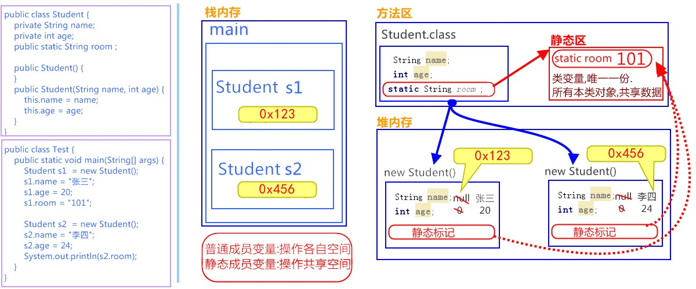

# 第一章 Scanner类

**Scanner类**
一个可以解析基本类型和字符串的简单文本扫描器。 例如，以下代码使用户能够从 System.in 中读取一个数：

```java
Scanner sc = new Scanner(System.in); 
int i = sc.nextInt();
```

**引用类型使用步骤**

使用import关键字导包，在类的所有代码之前导包，引入要使用的类型，java.lang包下的所有类无需导入。
格式：
```java
import 包名.类名;
```
例如：
```java
java.util.Scanner;
```

**创建对象**

使用该类的构造方法，创建一个该类的对象。 格式：

```java
数据类型 变量名 = new 数据类型(参数列表);
```


**调用方法**

调用该类的成员方法，完成指定功能。格式：

```java
变量名.方法名();
```

举例：
```java
int i = sc.nextInt(); //接收一个键盘录入的整数
```

## 1.1 Scanner的使用步骤

**查看类**
* `java.util.Scanner`：该类需要import导入后使用。

**查看构造方法**
* `public Scanner(InputStream source)`：构造一个新的`Scanner`，它生成的值是从指定的输入流扫描的。

**查看成员方法**
* `public int nextInt()`：将输入信息的下一个标记扫描为一个`int`值。

使用Scanner类，完成接收键盘录入数据的操作，代码如下：

```java
//1. 导包 
import java.util.Scanner; 
public class Demo01_Scanner {

    public static void main(String[] args) { 
        //2. 创建键盘录入数据的对象 
        Scanner sc = new Scanner(System.in);

        //3. 接收数据 
        System.out.println("请录入一个整数："); 
        int i = sc.nextInt();
        
        //4. 输出数据 
        System.out.println("i:"+i);

    }
}
```

**取最值**

```java
import java.util.Scanner; 
public class Test02Scanner {
    public static void main(String[] args) { 
        // 创建对象 
        Scanner sc = new Scanner(System.in); 
        // 接收数据 
        System.out.println("请输入第一个数据："); 
        int a = sc.nextInt(); 
        System.out.println("请输入第二个数据："); 
        int b = sc.nextInt();
        System.out.println("请输入第三个数据：");
        int c = sc.nextInt();

        // 如何获取三个数据的最大值
        int temp = (a > b ? a : b);
        int max = (temp > c ? temp : c);

        System.out.println("max:" + max);
    }
}
```

## 1.2 匿名对象

**概念**
创建对象时，只有创建对象的语句，却没有把对象地址值赋值给某个变量。虽然是创建对象的简化写法，但是应用 场景非常有限。

* **匿名对象**：没有变量名的对象。

格式：

```java
new 类名(参数列表);
```

举例：

```java
new Scanner(System.in);
```

**应用场景**
1. 创建匿名对象直接调用方法，没有变量名。

```java
new Scanner(System.in).nextInt();
```

2. 一旦调用两次方法，就是创建了两个对象，造成浪费。

```java
new Scanner(System.in).nextInt(); 
new Scanner(System.in).nextInt();
```

> Tips:一个匿名对象，只能使用一次。

3. 匿名对象可以作为`方法的参数和返回值`

* 作为参数

```java
class Test {

    public static void main(String[] args) { 
        // 普通方式 
        Scanner sc = new Scanner(System.in); 
        input(sc);
        //匿名对象作为方法接收的参数 
        input(new Scanner(System.in));
    }

    public static void input(Scanner sc){ 

        System.out.println(sc); 
    }

}
```

* 作为返回值

```java
class Test2 {

    public static void main(String[] args) { 
        // 普通方式
        Scanner sc = getScanner(); 
    }

    public static Scanner getScanner(){
        //普通方式 
        //Scanner sc = new Scanner(System.in); 
        //return sc;

        //匿名对象作为方法返回值 
        return new Scanner(System.in);

    }
}
```

# 第二章 Random类

**Random**：此类的实例用于生成伪随机数。

示例：

```java
//获取一个随机整数
Random r = new Random(); 
int i = r.nextInt();
```

## 2.1 Random使用步骤

**查看类**
* `java.util.Random`：该类需要 import导入使后使用。

**查看构造方法**
* `public Random()`：创建一个新的随机数生成器。

**查看成员方法**
* `public int nextInt(int n)`：返回一个伪随机数，范围在0（包括）和指定值 n（不包括）之间的`int`值。

**示例：**

```java
//生成3个10以内的随机整数
//1. 导包 
import java.util.Random; 
public class Demo01_Random {
    public static void main(String[] args) { 
        //2. 创建键盘录入数据的对象 
        Random r = new Random();
        for(int i = 0; i < 3; i++){ 
            //3. 随机生成一个数据 
            int number = r.nextInt(10); 
            //4. 输出数据 
            System.out.println("number:"+ number); 
        }
    }
}
```

> 创建一个`Random`对象，每次调用`nextInt()`方法，都会生成一个随机数。

# 第三章 ArrayList类

## 3.1 什么是ArrayList类

`java.util.ArrayList`是大小**可变的数组**的实现，存储在内的数据称为元素。此类提供一些方法来操作内部存储的元素。ArrayList中可不断添加元素，其大小也自动增长。

## 3.2 ArrayList使用步骤

**查看类**

* `java.util.ArrayList<E>`：该类需要 import导入使后使用。
  `E`，表示一种指定的数据类型，叫做泛型。`E`，取自Element（元素）的首字母。在出现`E`的地方，我们使用一种引用数据类型将其替换即可，表示我们将存储哪种引用类型的元素。

```java
ArrayList<String>，ArrayList<Student>
```

**查看构造方法**

* `public ArrayList()`：构造一个内容为空的集合。

基本格式:

```java
ArrayList<String> list = new ArrayList<String>();
```

在JDK 7后,右侧泛型的尖括号之内可以留空，但是<>仍然要写。简化格式：

```java
ArrayList<String> list = new ArrayList<>();
```

**查看成员方法**

* `public boolean add(E e)`： 将指定的元素添加到此集合的尾部。
  参数 E e ，在构造ArrayList对象时， <E> 指定了什么数据类型，那么`add(E e)`方法中，只能添加什么数据类型的对象。

示例：

```java
//使用ArrayList类，存储三个字符串元素，
public class Test02StudentArrayList {
    public static void main(String[] args) {
    //创建学生数组
    ArrayList<String> list = new ArrayList<>();

    //创建学生对象
    String s1 = "曹操";
    String s2 = "刘备";
    String s3 = "孙权";

    //打印学生ArrayList集合 
    System.out.println(list);

    //把学生对象作为元素添加到集合 
    list.add(s1); 
    list.add(s2); 
    list.add(s3);

    //打印学生ArrayList集合 
    System.out.println(list);
    }
}
```

## 3.3 常用方法和遍历

对于元素的操作,基本体现在——增、删、查。常用的方法有：

* `public boolean add(E e)`：将指定的元素添加到此集合的尾部。
* `public E remove(int index)`：移除此集合中指定位置上的元素。返回被删除的元素。 
* `public E get(int index)`：返回此集合中指定位置上的元素。返回获取的元素。 
* `public int size()`：返回此集合中的元素数。遍历集合时，可以控制索引范围，防止越界。

示例：

```java
public class Demo01ArrayListMethod {

    public static void main(String[] args) { 
        //创建集合对象
        ArrayList<String> list = new ArrayList<String>();
        //添加元素 
        list.add("hello"); 
        list.add("world"); 
        list.add("java");
        //public E get(int index):返回指定索引处的元素 
        System.out.println("get:"+list.get(0)); 
        System.out.println("get:"+list.get(1)); 
        System.out.println("get:"+list.get(2));
        
        //public int size():返回集合中的元素的个数 
        System.out.println("size:"+list.size());

        //public E remove(int index):删除指定索引处的元素，返回被删除的元素
        System.out.println("remove:"+list.remove(0));

        //遍历输出 
        for(int i = 0; i < list.size(); i++){ 
            System.out.println(list.get(i)); 
        }
    }
}
```

## 3.4 如何存储基本数据类型

ArrayList对象不能存储基本类型，只能存储引用类型的数据。类似`<int>`不能写，但是存储基本数据类型对应的包装类型是可以的。所以，想要存储基本类型数据，`<>`中的数据类型，必须转换后才能编写，转换写法如下：

| 基本类型 | 基本类型包装类 |
| -------- | -------------- |
| byte     | Byte           |
| short    | Short          |
| int      | Integer        |
| long     | Long           |
| float    | Float          |
| double   | Double         |
| char     | Character      |
| boolean  | Boolean        |

存储基本数据类型，示例：

```java
public class Demo02ArrayListMethod {
    public static void main(String[] args) { 
        ArrayList<Integer> list = new ArrayList<Integer>(); 
        list.add(1); 
        list.add(2); 
        list.add(3); 
        list.add(4);

        System.out.println(list);
    }
}
```

**对象添加到集合**

```java
//自定义4个学生对象,添加到集合,并遍历
public class Test02ArrayList {

    public static void main(String[] args) { 
        //创建集合对象
        ArrayList<Student> list = new ArrayList<Student>();
        
        //创建学生对象 
        Student s1 = new Student("赵丽颖",18); 
        Student s2 = new Student("唐嫣",20); 
        Student s3 = new Student("景甜",25); 
        Student s4 = new Student("柳岩",19);
        
        //把学生对象作为元素添加到集合中 
        list.add(s1); 
        list.add(s2); 
        list.add(s3); 
        list.add(s4);

        //遍历集合 
        for(int x = 0; x < list.size(); x++) {
            Student s = list.get(x);
            System.out.println(s.getName()+"‐‐‐"+s.getAge()); 
        }
    }
}
```

# 第四章 String类

**概述**

`java.lang.String`类代表字符串。Java程序中所有的字符串文字（例如"abc"）都可以被看作是实现此类的实例。类`String`中包括用于检查各个字符串的方法，比如用于`比较`字符串，`搜索`字符串，`提取`字符串以及创建具有翻译为`大写`或`小写`的所有字符的字符串的副本。

**特点**

1. 字符串不变：字符串的值在创建后不能被更改。

```java
String s1 = "abc"; s1 += "d"; 
System.out.println(s1); // "abcd" 
// 内存中有"abc"，"abcd"两个对象，s1从指向"abc"，改变指向，指向了"abcd"。
```

2.因为String对象是不可变的，所以它们可以被共享。

```java
String s1 = "abc"; 
String s2 = "abc"; 
// 内存中只有一个"abc"对象被创建，同时被s1和s2共享。
```

3."abc"等效于char[] data={ 'a' , 'b' , 'c' }。

```java
例如：
String str = "abc";

相当于：
char data[] = {'a', 'b', 'c'}; 
String str = new String(data); 
//String底层是靠字符数组实现的。
```

## 4.1 使用步骤

* **查看类**
  *  java.lang.String：此类不需要导入。

* **查看构造方法**
  * `public String()`：初始化新创建的String对象，以使其表示空字符序列。
  * `public String(char[] value)`：通过当前参数中的字符数组来构造新的String。
  * `public String(byte[] bytes)`：通过使用平台的默认字符集解码当前参数中的字节数组来构造新的String。

**构造，示例**

```java
//无参构造 
String str = new String();

//通过字符数组构造 
char chars[] = {'a', 'b', 'c'}; 
String str2 = new String(chars);

//通过字节数组构造 
byte bytes[] = { 97, 98, 99 }; 
String str3 = new String(bytes);
```

## 4.2 常用方法

**判断功能的方法**

* `public boolean equals (Object anObject)`：将此字符串与指定对象进行比较。
* `public boolean equalsIgnoreCase (String anotherString)`：将此字符串与指定对象进行比较，忽略大小写。

**示例**

```java
public class String_Demo01 {

    public static void main(String[] args) { 
        // 创建字符串对象 
        String s1 = "hello"; 
        String s2 = "hello"; 
        String s3 = "HELLO";
        
        // boolean equals(Object obj):比较字符串的内容是否相同 
        System.out.println(s1.equals(s2)); // true 
        System.out.println(s1.equals(s3)); // false 
        System.out.println("‐‐‐‐‐‐‐‐‐‐‐");

        //boolean equalsIgnoreCase(String str):比较字符串的内容是否相同,忽略大小写 
        System.out.println(s1.equalsIgnoreCase(s2)); // true 
        System.out.println(s1.equalsIgnoreCase(s3)); // true 
        System.out.println("‐‐‐‐‐‐‐‐‐‐‐");
    }
}
```

> Object 是”对象”的意思，也是一种引用类型。作为参数类型，表示任意对象都可以传递到方法中。

**获取功能的方法**

* `public int length()`：返回此字符串的长度。
* `public String concat (String str)`：将指定的字符串连接到该字符串的末尾。
* `public char charAt (int index)`：返回指定索引处的char值。
* `public int indexOf (String str)`：返回指定子字符串第一次出现在该字符串内的索引。
* `public String substring (int beginIndex)`：返回一个子字符串，从beginIndex开始截取字符串到字符串结尾。
* `public String substring (int beginIndex, int endIndex)`：返回一个子字符串，从beginIndex到endIndex截取字符串。含beginIndex，不含endIndex。

**示例**

```java
public class String_Demo02 {

    public static void main(String[] args) { 
        //创建字符串对象
        String s = "helloworld";
        // int length():获取字符串的长度，其实也就是字符个数 
        System.out.println(s.length()); 
        System.out.println("‐‐‐‐‐‐‐‐");

        // String concat (String str):将指定的字符串连接到该字符串的末尾.
        String s = "helloworld";
        String s2 = s.concat("**hello nihao");

        System.out.println(s2);// helloworld**hello nihao

        // char charAt(int index):获取指定索引处的字符 
        System.out.println(s.charAt(0)); 
        System.out.println(s.charAt(1)); 
        System.out.println("‐‐‐‐‐‐‐‐");

        // int indexOf(String str):获取str在字符串对象中第一次出现的索引,没有返回‐1 
        System.out.println(s.indexOf("l")); 
        System.out.println(s.indexOf("owo")); 
        System.out.println(s.indexOf("ak")); 
        System.out.println("‐‐‐‐‐‐‐‐");

        // String substring(int start):从start开始截取字符串到字符串结尾 
        System.out.println(s.substring(0)); 
        System.out.println(s.substring(5)); 
        System.out.println("‐‐‐‐‐‐‐‐");

        // String substring(int start,int end):从start到end截取字符串。含start，不含end。 
        System.out.println(s.substring(0, s.length())); 
        System.out.println(s.substring(3,8));
    }
}
```

**转换功能的方法**

* `public char[] toCharArray()`：将此字符串转换为新的字符数组。
* `public byte[] getBytes()`：使用平台的默认字符集将该 String编码转换为新的字节数组。
* `public String replace (CharSequence target, CharSequence replacement)`：将与target匹配的字符串使用replacement字符串替换。

**示例**

```java
public class String_Demo03 {

    public static void main(String[] args) { 
        //创建字符串对象
        String s = "abcde";

        // char[] toCharArray():把字符串转换为字符数组 
        char[] chs = s.toCharArray(); 
        for(int x = 0; x < chs.length; x++) { 
            System.out.println(chs[x]); 
        } 
        System.out.println("‐‐‐‐‐‐‐‐‐‐‐");

        // byte[] getBytes ():把字符串转换为字节数组 
        byte[] bytes = s.getBytes(); 
        for(int x = 0; x < bytes.length; x++) { 
            System.out.println(bytes[x]); 
        }
        System.out.println("‐‐‐‐‐‐‐‐‐‐‐");

    // 替换字母it为大写IT
    String str = "it123 it321"; 
    String replace = str.replace("it", "IT"); 
    System.out.println(replace); // IT123 IT321 
    }
}
```

> CharSequence 是一个接口，也是一种引用类型。作为参数类型，可以把String对象传递到方法中。

**分割功能的方法**

* `public String[] split(String regex)`：将此字符串按照给定的regex（规则）拆分为字符串数组。

**示例**

```java
public class String_Demo03 {

    public static void main(String[] args) { 

        //创建字符串对象
        String s = "aa|bb|cc";
        // ["aa","bb","cc"]
        String[] strArray = s.split("\\|");

        for(int x = 0; x < strArray.length; x++) { 
            // aa bb cc 
            System.out.println(strArray[x]);
        }
    }
}
```

# 第五章 static类

**概述**
`static`关键字的使用，它可以用来修饰的成员变量和成员方法，被修饰的成员是属于类的，而不是单单是属于某个对象的。也就是说，既然属于类，就可以不靠创建对象来调用了。

## 5.1 定义和使用格式

**类变量**

当`static`修饰成员变量时，该变量称为类变量。该类的每个对象都共享同一个类变量的值。任何对象都可以更改该类变量的值，但也可以在不创建该类的对象的情况下对类变量进行操作。

* **类变量：** 使用 static关键字修饰的成员变量。

**定义格式：**

```java
static 数据类型 变量名
```

**举例：**

```java
static int numberID;
```

**静态方法**

当`static`修饰成员方法时，该方法称为类方法 。静态方法在声明中有创建类的对象。调用方式非常简单。

* **类方法：** 使用static关键字修饰的成员方法，习惯称为**静态方法**。

**定义格式：**

```java
修饰符 static 返回值类型 方法名(参数列表) {
    //执行语句
}
```

* **静态方法调用的注意事项：**
  * 静态方法可以直接访问类变量和静态方法。
  * 静态方法**不能直接访问**普通成员变量或成员方法。反之，成员方法可以直接访问类变量或静态方法。
  * 静态方法中，不能使用this关键字。

> Tips：静态方法只能访问静态成员。

**调用格式**

static修饰的成员可以并且建议通过**类名直接访问**。虽然也可以通过对象名访问静态成员，原因即多个对象均属于一个类，共享使用同一个静态成员，但是不建议，会出现警告信息。

**格式：**

```java
// 访问类变量 
类名.类变量名;

// 调用静态方法 
类名.静态方法名(参数);
```

## 5.2 静态原理图解

`static`修饰的内容：

* 是随着类的加载而加载的，且只加载一次。 
* 存储于一块固定的内存区域（静态区），所以，可以直接被类名调用。 
* 它优先于对象存在，所以，可以被所有对象共享。

- 

## 5.3 静态代码块

* **静态代码块：** 定义在成员位置，使用static修饰的代码块{}。
  * **位置：** 类中方法外。
  * **执行：** 随着类的加载而执行且执行一次，优先于main方法和构造方法的执行。

**格式：**

```java
public class ClassName{ 
    static { 
        // 执行语句 
    } 
}
```

**示例：**

```java
public class Game{

    public static int number;
    public static ArrayList<String> list;

    static {

        // 给类变量赋值
        number = 2;
        list = new ArrayList<String>();
        // 添加元素到集合中
        list.add("张三");
        list.add("李四");
    }

}
```

> Tips:
> static 关键字，可以修饰变量、方法和代码块。在使用的过程中，其主要目的还是想在不创建对象的情况 下，去调用方法。

# 第六章 Arrays类

**概述**

`java.util.Arrays`此类包含用来操作数组的各种方法，比如排序和搜索等。其所有方法均为静态方法，调用起来非常简单。

## 6.1 常用方法

* `public static String toString(int[] a)`：返回指定数组内容的字符串表示形式。
* `public static void sort(int[] a)`：对指定的int型数组按数字升序进行排序。

**示例：**

```java
public static void tostringTest() {

    int[] arr = {12,8,56,876,6};

    //打印的是地址值[I@29453f44
    System.out.println(arr);

    String str = Arrays.toString(arr);

    //打印字符串的内容
    // [12, 8, 56, 876, 6]
    System.out.println(str);

    //排序前:[12, 8, 56, 876, 6]
    System.out.println("排序前:"+ Arrays.toString(arr));

    //升序排序
    Arrays.sort(arr);

    //排序后:[6, 8, 12, 56, 876]
    System.out.println("排序后:"+ Arrays.toString(arr));
}
```

# 第七章 Math类

**概述**

`java.lang.Math`类包含用于执行基本数学运算的方法，如初等指数、对数、平方根和三角函数。

## 7.1 基本运算的方法

* `public static double abs(double a)`：返回 double 值的绝对值。
* `public static double ceil(double a)`：返回大于等于参数的最小的整数（向上取整）。
* `public static double floor(double a)`：返回小于等于参数最大的整数（向下取整）。
* `public static long round(double a)`：返回最接近参数的long。(四舍五入)

**示例：**

```java
double d1 = Math.abs(‐5); //d1的值为5 
double d2 = Math.abs(5); //d2的值为5

double d1 = Math.ceil(3.3); //d1的值为 4.0 
double d2 = Math.ceil(‐3.3); //d2的值为 ‐3.0 
double d3 = Math.ceil(5.1); //d3的值为 6.0

double d1 = Math.floor(3.3); //d1的值为3.0 
double d2 = Math.floor(‐3.3); //d2的值为‐4.0 
double d3 = Math.floor(5.1); //d3的值为 5.0

long d1 = Math.round(5.5); //d1的值为6.0 
long d2 = Math.round(5.4); //d2的值为5.0

```
