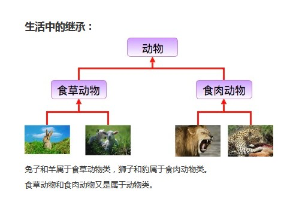
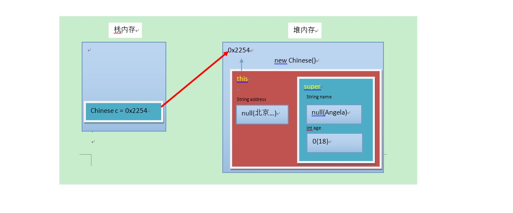

# 第一章 继承

## 1.1 继承的概述

多个类中存在相同属性和行为时，将这些内容抽取到单独一个类中，那么多个类无需再定义这些属性和行为，只要继承那一个类即可。

- 

其中，多个类可以称为**子类**，单独那一个类称为**父类**、**超类（superclass）** 或者 **基类**。

继承描述的是事物之间的所属关系，这种关系是：`is-a`的关系。例如，图中兔子属于食草动物，食草动物属于动物。可见，父类更通用，子类更具体。我们通过继承，可以使多种事物之间形成一种关系体系。

## 1.2 继承的定义

* **继承**：就是子类继承父类的**属性**和**行为**，使得子类对象具有与父类相同的属性、相同的行为。子类可以直接访问父类中的**非私有**的属性和行为。

**优点**

* 提高**代码的复用性**。
* 类与类之间产生了关系，是**多态的前提**。

## 1.3 继承的格式

通过`extends`关键字，可以声明一个子类继承另外一个父类

```java
class 父类 {
    ...
}

class 子类 extends 父类 {
    ...
}
```

**示例：**

```java
/**
    * 定义员工类Employee，做为父类
    */
class Employee {

    // 定义name属性
    String name;
    // 定义员工的工作方法
    public void work() {
        System.out.println("尽心尽力地工作");
    }

}

/**
    * 定义讲师类Teacher 继承员工类Employee
    */
class Teacher extends Employee {

    // 定义一个打印name的方法
    public void printName() {
        System.out.println("name=" + name);
    }
}

/**
    * 定义测试类
    */
public class ExtendDemo01 {

    public static void main(String[] args) {

        // 创建一个讲师类对象
        Teacher t = new Teacher();

        // 为该员工类的name属性进行赋值
        t.name = "小明";

        // 调用该员工的printName()方法
        t.printName(); // name = 小明

        // 调用Teacher类继承来的work()方法
        t.work(); // 尽心尽力地工作
    }
}
```

## 1.4 继承后的特点——成员变量

子类父类中出现**不重名**的成员变量，这时的访问是**没有影响**的。
子父类中出现了同名的成员变量时，在子类中需要访问父类中非私有成员变量时，需要使用`super`关键字，修饰父类成员变量。

**格式**

```java
super.父类成员变量名
```

```java
class Fu {
    // Fu中的成员变量。
    int num = 5;
}

class Zi extends Fu {

    // Zi中的成员变量
    int num = 6;

    public void show() {

        // 访问父类中的num
        System.out.println("Fu num=" + super.num);
        // 访问子类中的num
        System.out.println("Zi num=" + this.num);
    }

}

public class ExtendsDemo {
    public static void main(String[] args) {

        Zi zi = new Zi();

        // 子类中有show方法，只执行重写后的show方法
        zi.show();
    }
}

/**
 * 输出结果：
 * Fu num=5
 * Zi num=6
 */
```

> Tips:
> Fu类中的成员变量是非私有的，子类中可以直接访问。若Fu类中的成员变量私有了，子类是不能直接访问的。通常编码时，我们遵循封装的原则，使用private修饰成员变量。可以在父类中提供公共的getXxx方法和setXxx方法，访问父类的私有成员变量。

## 1.5 继承后的特点——成员方法

子类父类中出现**不重名**的成员方法，这时的调用是**没有影响**。对象调用方法时，会先在子类中查找有没有对应的方法，若子类中存在就会执行子类中的方法，若子类中不存在就会执行父类中相应的方法。

**成员方法重名——重写(Override)**

子类父类中出现**重名**的成员方法，这时的访问是一种特殊情况，叫做**方法重写 (Override)**。

* **方法重写** ：子类中出现与父类一模一样的方法时（返回值类型，方法名和参数列表都相同），会出现覆盖效果，也称为重写或者复写。**声明不变，重新实现**。

```java
class Fu {

    public void show() {
        System.out.println("Fu show");
    }

}

class Zi extends Fu {

    //子类重写了父类的show方法
    public void show() {
        System.out.println("Zi show");
    }

}

public class ExtendsDemo {
    public static void main(String[] args) {

        Zi zi = new Zi();

        // 子类中有show方法，只执行重写后的show方法
        zi.show();
    }
}

/**
 * 输出结果：
 * Zi show
 */
```

> Tips：
> 子类可以根据需要，定义特定于自己的行为。既沿袭了父类的功能名称，又根据子类的需要重新实现父类方法，从而进行扩展增强。

**注意事项**
1. 子类方法覆盖父类方法，必须要保证权限大于等于父类权限。
2. 子类方法覆盖父类方法，返回值类型、函数名和参数列表都要一模一样。

## 1.6 继承后的特点——构造方法

1. 构造方法的名字是与类名一致的。所以子类是无法继承父类构造方法的。
2. 构造方法的作用是初始化成员变量的。所以子类的初始化过程中，必须先执行父类的初始化动作。子类的构 造方法中默认有一个`super()`，表示调用父类的构造方法，父类成员变量初始化后，才可以给子类使用。

```java
class Fu {

    private int n;

    public Fu() {
        System.out.println("Fu()");
    }
}

class Zi extends Fu {

    public Zi() {

        super();
        System.out.println("Zi()");
    }

}

public class ExtendsDemo{

    public static void main(String[] args) {
        Zi zi = new Zi();
    }

}

/**
 * 输出结果：
 * Fu()
 * Zi()
 */
```

## 1.7 super和this

**父类空间优先于子类对象产生**

在每次创建子类对象时，先初始化父类空间，再创建其子类对象本身。目的在于子类对象中包含了其对应的父类空间，便可以包含其父类的成员，如果父类成员非private修饰，则子类可以随意使用父类成员。代码体现在子类的构造方法调用时，一定先调用父类的构造方法。

- 

**super和this的含义**

* **super**：代表父类的**存储空间标识**(可以理解为父类的引用)。
* **this**：代表当前**对象的引用**(谁调用就代表谁)。

**super和this的用法**

1. 访问成员

```java
this.成员变量   -- 本类的
super.成员变量  -- 父类的

this.成员方法名()   -- 本类的
super.成员方法名()  -- 父类的
```

2. 访问构造方法

```java
this(...);  -- 本类的构造方法
super(...); -- 父类的构造方法
```

> Tips:
> 子类的每个构造方法中均有默认的super()，调用父类的空参构造。手动调用父类构造会覆盖默认的super()。
> super()和this()都必须是在构造方法的第一行，所以不能同时出现。

## 1.8 继承的特点

1. Java只支持单继承，不支持多继承。
2. Java支持多层继承(继承体系)。
3. 子类和父类是一种相对的概念。

```java
//一个类只能有一个父类，不可以有多个父类。 
class C extends A{} //ok 
class C extends A,B... //error

class A{} 
class B extends A{} 
class C extends B{}
```

> 顶层父类是Object类。所有的类默认继承Object，作为父类。

# 第二章 抽象类

## 2.1 抽象类的概述

父类中的方法，被它的子类们重写，子类各自的实现都不尽相同。那么父类的方法声明和方法主体，只有声明还有意义，而方法主体则没有存在的意义了。我们把没有方法主体的方法称为**抽象方法**。Java语法规定，包含抽象方法的类就是**抽象类**。

## 2.2 抽象类的定义

* **抽象方法**： 没有方法体的方法。
* **抽象类**：包含抽象方法的类。

## 2.3 abstract使用格式

### 2.3.1 抽象方法

使用`abstract`关键字修饰方法，该方法就成了抽象方法，抽象方法只包含一个方法名，而没有方法体。

**格式**

```java
修饰符 abstract 返回值类型 方法名 (参数列表);
```

**示例**

```java
public abstract void run();
```

### 2.3.2 抽象类

如果一个类包含抽象方法，那么该类必须是抽象类。

**格式**

```java
abstract class 类名字 {

}
```

**示例**

```java
public abstract class Animal { 
    public abstract void run();
}
```

### 2.3.3 抽象的使用

继承抽象类的子类**必须重写父类所有的抽象方法**。否则，该子类也必须声明为抽象类。最终，必须有子类实现该父类的抽象方法，否则，从最初的父类到最终的子类都不能创建对象，失去意义。

```java
public abstract class Animal {
    public abstract void run();
}

public class Cat extends Animal {

    public void run() {
        System.out.println("猫在跑");
    }
}

public class CatTest {

    public static void main(String[] args) {
        //创建子类对象
        Cat cat = new Cat();
        //调用run方法
        cat.run();
    }
}

//输出结果：猫在跑
```

> 此时的方法重写，是子类对父类抽象方法的完成实现，我们将这种方法重写的操作，也叫做**实现方法**。

## 2.4 注意事项

1. 抽象类不能创建对象，如果创建，编译无法通过而报错。只能创建其非抽象子类的对象。
> 理解：假设创建了抽象类的对象，调用抽象的方法，而抽象方法没有具体的方法体，没有意义。
2. 抽象类中，可以有构造方法，是供子类创建对象时，初始化父类成员使用的。
> 理解：子类的构造方法中，有默认的super()，需要访问父类构造方法。
3. 抽象类中，不一定包含抽象方法，但是有抽象方法的类必定是抽象类。
> 理解：未包含抽象方法的抽象类，目的就是不想让调用者创建该类对象，通常用于某些特殊的类结构设计。
4. 抽象类的子类，必须重写抽象父类中所有的抽象方法，否则，编译无法通过而报错。除非该子类也是抽象类。
> 理解：假设不重写所有抽象方法，则类中可能包含抽象方法。那么创建对象后，调用抽象的方法，没有意义。

# 第三章 接口

## 3.1 接口的概述

接口，是Java语言中一种引用类型，是方法的集合，如果说类的内部封装了成员变量、构造方法和成员方法，那么接口的内部主要就是**封装了方法**，包含抽象方法（JDK 7及以前），默认方法和静态方法（JDK 8），私有方法（JDK 9）。
接口的定义，它与定义类方式相似，但是使用`interface`关键字。它也会被编译成.class文件，但一定要明确它并不是类，而是另外一种引用数据类型。

> 引用数据类型：数组，类，接口。

接口的使用，它不能创建对象，但是可以被实现（`implements`，类似于被继承）。一个实现接口的类（可以看做是接口的子类），需要实现接口中所有的抽象方法，创建该类对象，就可以调用方法了，否则它必须是一个抽象类。

## 3.2 接口的定义

```java
public interface 接口名称 { 
    // 抽象方法 
    // 默认方法 
    // 静态方法 
    // 私有方法 
}
```

### 3.2.1 含有抽象方法

**抽象方法**：使用`abstract`关键字修饰，可以省略，没有方法体。该方法供子类实现使用。

```java
public interface InterFaceName { 
    public abstract void method();
}
```

### 3.2.2 含有默认方法和静态方法

**默认方法**：使用`default`修饰，不可省略，供子类调用或者子类重写。
**静态方法**：使用`static`修饰，供接口直接调用。

```java
public interface InterFaceName {

    public default void method() { 
        // 执行语句
    } 

    public static void method2() {
        // 执行语句 
    }

}
```

### 3.2.3 含有私有方法和私有静态方法

**私有方法**：使用`private`修饰，供接口中的默认方法或者静态方法调用。

```java
public interface InterFaceName { 
    private void method() { 
        // 执行语句 
    } 
}
```

## 3.3 基本的实现

### 3.3.1 实现的概述

类与接口的关系为实现关系，即**类实现接口**，该类可以称为接口的实现类，也可以称为接口的子类。实现的动作类似继承，格式相仿，只是关键字不同，实现使用`implements`关键字。

**非抽象子类实现接口**：
1. 必须重写接口中所有抽象方法。
2. 继承了接口的默认方法，即可以直接调用，也可以重写。

```java
class 类名 implements 接口名 { 
    // 重写接口中抽象方法【必须】 
    // 重写接口中默认方法【可选】 
}
```

### 3.3.2 抽象方法的使用

**定义接口**：

```java
public interface LiveAble { 
    // 定义抽象方法 
    public abstract void eat(); 
    public abstract void sleep(); 
}
```

**定义实现类**：

```java
public class Animal implements LiveAble { 

    @Override 
    public void eat() { 
        System.out.println("吃东西");
    }
    
    @Override 
    public void sleep() { 
        System.out.println("晚上睡"); 
    }

}
```

**定义测试类**

```java
public class InterfaceDemo {

    public static void main(String[] args) { 
        // 创建子类对象 
        Animal a = new Animal(); 
        // 调用实现后的方法 
        a.eat(); 
        a.sleep();
    }

} 

//输出结果： 吃东西 晚上睡
```

### 3.3.3 默认方法的使用

可以继承，可以重写，二选一，但是只能通过实现类的对象来调用。

#### 3.3.3.1 继承默认方法

**定义接口**：

```java
public interface LiveAble { 
    public default void fly(){ 
        System.out.println("天上飞"); 
    }
}
```

**定义实现类**：

```java
public class Animal implements LiveAble { 
    // 继承，什么都不用写，直接调用 
}
```

**定义测试类**：

```java
public class InterfaceDemo {

    public static void main(String[] args) { 
        // 创建子类对象 
        Animal a = new Animal(); 
        // 调用默认方法 
        a.fly(); 
    }

} 

//输出结果： 天上飞
```

#### 3.3.3.2 重写默认方法

**定义接口**：

```java
public interface LiveAble { 
    public default void fly(){ 
        System.out.println("天上飞"); 
    }
}
```

**定义实现类**：

```java
public class Animal implements LiveAble { 

    @Override 
    public void fly() { 
        System.out.println("自由自在的飞"); 
    }
}
```

**定义测试类**：

```java
public class InterfaceDemo {

    public static void main(String[] args) { 
        // 创建子类对象 
        Animal a = new Animal(); 
        // 调用重写方法 
        a.fly(); 
    }

} 

//输出结果： 自由自在的飞
```

### 3.3.4 静态方法的使用

静态与.class文件相关，只能使用接口名调用，不可以通过实现类的类名或者实现类的对象调用

**定义接口**：

```java
public interface LiveAble { 

    public static void run(){ 
        System.out.println("跑起来~~~"); 
    }
}
```

**定义实现类**：

```java
public class Animal implements LiveAble { 
    // 无法重写静态方法 
}
```

**定义测试类**：

```java
public class InterfaceDemo { 
    public static void main(String[] args) { 
        // Animal.run(); // 【错误】无法继承方法,也无法调用 
        LiveAble.run(); 
    } 
} 

//输出结果： 跑起来~~~
```

### 3.3.5 私有方法的使用

* 私有方法：只有默认方法可以调用。
* 私有静态方法：默认方法和静态方法可以调用。

一个接口中有多个默认方法，并且方法中有重复的内容，那么可以抽取出来，封装到私有方法中，供默认方法去调用。从设计的角度讲，私有的方法是对默认方法和静态方法的辅助。

**定义接口**：

```java
public interface LiveAble { 

    default void func() { 
        func1();
        func2(); 
    }

    private void func1(){ 
        System.out.println("跑起来~~~"); 
    }

    private void func2(){ 
        System.out.println("跑起来~~~"); 
    }

}
```

## 3.4 接口的多实现

继承体系中，一个类只能继承一个父类。而对于接口而言，一个类是可以实现多个接口的，这叫做**接口的多实现**。并且，一个类能继承一个父类，同时实现多个接口。

**实现格式**：

```java
class 类名 [extends 父类名] implements 接口名1,接口名2,接口名3... { 
    // 重写接口中抽象方法【必须】 
    // 重写接口中默认方法【不重名时可选】 
}
```

> [ ]： 表示可选操作。

### 3.4.1 抽象方法

接口中，有多个抽象方法时，实现类必须重写所有抽象方法。**如果抽象方法有重名的，只需要重写一次**。

**定义多个接口**：

```java
interface A { 
    public abstract void showA(); 
    public abstract void show();
}

interface B { 
    public abstract void showB(); 
    public abstract void show(); 
}
```

**定义实现类**：

```java
public class C implements A,B{
    
    @Override 
    public void showA() { 
        System.out.println("showA"); 
    }
    
    @Override 
    public void showB() { 
        System.out.println("showB"); 
    }

    @Override 
    public void show() { 
        System.out.println("show"); 
    }
}
```

### 3.4.2 默认方法

接口中，有多个默认方法时，实现类都可继承使用。**如果默认方法有重名的，必须重写一次**。

**定义多个接口**：

```java
interface A { 
    public abstract void methodA(); 
    public abstract void method();
}

interface B { 
    public abstract void methodB(); 
    public abstract void method(); 
}
```

**定义实现类**：

```java
public class C implements A,B{

    @Override 
    public void method() { 
        System.out.println("method"); 
    }
}
```

### 3.4.3 静态方法

接口中，存在同名的静态方法并不会冲突，原因是只能通过各自接口名访问静态方法。

**优先级的问题**

当一个类，既继承一个父类，又实现若干个接口时，父类中的成员方法与接口中的默认方法重名，子类就近选择执行父类的成员方法。

**定义接口**：

```java
interface A {
    public default void methodA() { 
        System.out.println("AAAAAAAAAAAA"); 
    } 
}
```

**定义父类**：

```java
class D {
    public void methodA() { 
        System.out.println("DDDDDDDDDDDD"); 
    } 
}
```

**定义子类**：

```java
class C extends D implements A { 
    // 未重写methodA方法 
}
```

**定义测试类**：

```java
public class Test { 

    public static void main(String[] args) {
        C c = new C();
        c.methodA();
    }
} 

//输出结果: DDDDDDDDDDDD
```

## 3.5 接口的多继承

一个接口能继承另一个或者多个接口，这和类之间的继承比较相似。接口的继承使用`extends`关键字，子接口继承父接口的方法。**如果父接口中的默认方法有重名的，那么子接口需要重写一次**。

**定义父接口**：

```java
interface A { 
    public default void method() { 
        System.out.println("AAAAAAAAAAAAAAAAAAA"); 
    } 
}

interface B { 
    public default void method() { 
        System.out.println("BBBBBBBBBBBBBBBBBBB"); 
    } 
}
```

**定义子接口**：

```java
interface D extends A,B{ 
    @Override 
    public default void method() { 
        System.out.println("DDDDDDDDDDDDDD"); 
    } 
}
```

> Tips:
> 子接口重写默认方法时，default关键字可以保留。
> 子类重写默认方法时，default关键字不可以保留。

## 3.6 其他成员特点

* 接口中，无法定义成员变量，但是可以定义常量，其值不可以改变，默认使用public static final修饰。 
* 接口中，没有构造方法，不能创建对象。 
* 接口中，没有静态代码块。

# 第四章 多态

## 4.1 多态的概述

多态是继封装、继承之后，面向对象的第三大特性。
生活中，比如跑的动作，小猫、小狗和大象，跑起来是不一样的。再比如飞的动作，昆虫、鸟类和飞机，飞起来也是不一样的。可见，同一行为，通过不同的事物，可以体现出来的不同的形态。多态，描述的就是这样的状态。

* **多态**：是指同一行为，具有多个不同表现形式。

**前提**：
1. 继承或者实现【二选一】
2. 方法的重写【意义体现：不重写，无意义】
3. 父类引用指向子类对象【格式体现】

## 4.2 多态的体现

**多态体现的格式**：

```java
父类类型 变量名 = new 子类对象; 
变量名.方法名();
```

> 父类类型：指子类对象继承的父类类型，或者实现的父接口类型。

**示例**：

```java
Fu f = new Zi();
f.method();
```

**当使用多态方式调用方法时，首先检查父类中是否有该方法，如果没有，则编译错误；如果有，执行的是子类重写后方法。**

**定义父类**：

```java
public abstract class Animal { 
    public abstract void eat(); 
}
```

**定义子类**：

```java
class Cat extends Animal { 
    public void eat() { 
        System.out.println("吃鱼"); 
    } 
}

class Dog extends Animal { 
    public void eat() { 
        System.out.println("吃骨头"); 
    } 
}
```

**定义测试类**：

```java
public class Test {

    public static void main(String[] args) { 
        // 多态形式，创建对象 
        Animal a1 = new Cat(); 
        // 调用的是 Cat 的 eat 
        a1.eat();

        // 多态形式，创建对象 
        Animal a2 = new Dog(); 
        // 调用的是 Dog 的 eat 
        a2.eat();
    }
}
```

## 4.3 多态的优点

实际开发的过程中，父类类型作为方法形式参数，传递子类对象给方法，进行方法的调用，更能体现出多态的扩展性与便利。

**定义父类**：

```java
public abstract class Animal { 
    public abstract void eat(); 
}
```

**定义子类**：

```java
class Cat extends Animal { 
    public void eat() { 
        System.out.println("吃鱼"); 
    }
}

class Dog extends Animal { 
    public void eat() { 
        System.out.println("吃骨头"); 
    } 
}
```

**定义测试类**：

```java
public class Test {

    public static void main(String[] args) { 
        // 多态形式，创建对象 
        Cat c = new Cat(); 
        Dog d = new Dog();

        // 调用showCatEat 
        showCatEat(c); 
        // 调用showDogEat
        showDogEat(d);

        /* 
        以上两个方法, 均可以被showAnimalEat(Animal a)方法所替代 
        而执行效果一致 
        */ 
        
        showAnimalEat(c); 
        showAnimalEat(d);

    }

    public static void showCatEat (Cat c) { 
        c.eat(); 
    }

    public static void showDogEat (Dog d) { 
        d.eat(); 
    }

    public static void showAnimalEat (Animal a) {
        a.eat(); 
    }

}
```

由于多态特性的支持，showAnimalEat方法的Animal类型，是Cat和Dog的父类类型，父类类型接收子类对象，当然可以把Cat对象和Dog对象，传递给方法。

当eat方法执行时，多态规定，执行的是子类重写的方法，那么效果自然与showCatEat、showDogEat方法一致，所以showAnimalEat完全可以替代以上两方法。

不仅仅是替代，在扩展性方面，无论之后再多的子类出现，我们都不需要编写showXxxEat方法了，直接使用showAnimalEat都可以完成。

## 4.4 引用类型转换

多态的转型分为**向上转型**与**向下转型**

### 4.4.1 向上转型

* **向上转型**：多态本身是子类类型向父类类型向上转换的过程，这个过程是默认的。
当父类引用指向一个子类对象时，便是向上转型。

**格式**：
```java
父类类型 变量名 = new 子类类型(); 
如：Animal a = new Cat();
```

### 4.4.2 向下转型

* **向下转型**：父类类型向子类类型向下转换的过程，这个过程是强制的。
一个已经向上转型的子类对象，将父类引用转为子类引用，可以使用强制类型转换的格式，便是向下转型。

**格式**：

```java
子类类型 变量名 = (子类类型) 父类变量名;
如:Cat c =(Cat) a;
```

**为什么要转型**

当使用多态方式调用方法时，首先检查父类中是否有该方法，如果没有，则编译错误。也就是说，**不能调用**子类拥有，而父类没有的方法。编译都错误，更别说运行了。这也是多态给我们带来的一点"小麻烦"。所以，想要调用子类特有的方法，必须做向下转型。

**定义类**：

```java

abstract class Animal { 
    abstract void eat(); 
}

class Cat extends Animal {

    public void eat() { 
        System.out.println("吃鱼"); 
    } 

    public void catchMouse() {
        System.out.println("抓老鼠"); 
    }

}

class Dog extends Animal {

    public void eat() { 
        System.out.println("吃骨头"); 
    } 

    public void watchHouse() {
        System.out.println("看家"); 
    }
}
```

**定义测试类**：

```java
public class Test {

    public static void main(String[] args) { 
        // 向上转型 
        Animal a = new Cat(); 
        a.eat(); // 调用的是 Cat 的 eat

        // 向下转型 
        Cat c = (Cat)a; 
        c.catchMouse();// 调用的是 Cat 的 catchMouse

    }
}
```

**转型的异常**


