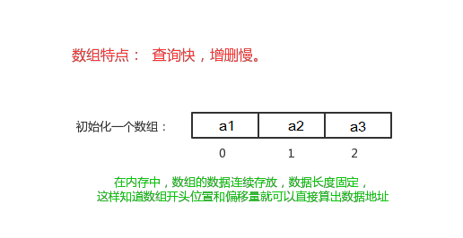

# 第一章 Collection集合

## 1.1 集合概述

* **集合**：集合是java中提供的一种容器，可以用来存储多个数据。

**数组与集合的区别**

* 数组的长度是固定的。集合的长度是可变的。
* 数组中存储的是同一类型的元素，可以存储基本数据类型值。集合存储的都是对象。而且对象的类型可以不一致。在开发中一般当对象多的时候，使用集合进行存储。

## 1.2  集合框架

集合按照其存储结构可以分为两大类，分别是单列集合`java.util.Collection`和双列集合`java.util.Map`。

* **Collection**：单列集合类的根接口，用于存储一系列符合某种规则的元素，它有两个重要的子接口，分别是`java.util.List`和`java.util.Set`。其中，`List`的特点是元素有序、元素可重复。`Set`的特点是元素无序，而且不可重复。`List`接口的主要实现类有`java.util.ArrayList`和`java.util.LinkedList`，`Set`接口的主要实现类有`java.util.HashSet`和`java.util.TreeSet`。


## 1.3 Collection 常用方法

Collection是所有单列集合的父接口，Collection中定义了单列集合(List和Set)通用的一些方法，这些方法可用于操作所有的单列集合。

* `public boolean add(E e)`：  把给定的对象添加到当前集合中 。
* `public void clear()` :清空集合中所有的元素。
* `public boolean remove(E e)`: 把给定的对象在当前集合中删除。
* `public boolean contains(E e)`: 判断当前集合中是否包含给定的对象。
* `public boolean isEmpty()`: 判断当前集合是否为空。
* `public int size()`: 返回集合中元素的个数。
* `public Object[] toArray()`: 把集合中的元素，存储到数组中。

**示例**

```java
public class CollectionDemo01 {
    public static void main(String[] args) {
        // 创建集合对象
        // 使用多态形式
        Collection<String> coll = new ArrayList<String>();
        // 使用方法
        // 添加功能  boolean add(String s)
        coll.add("小李广");
        coll.add("扫地僧");
        coll.add("石破天");
        System.out.println(coll);

        // boolean contains(E e) 判断o是否在集合中存在
        System.out.println("判断[扫地僧]是否在集合中:" + coll.contains("扫地僧"));

        //boolean remove(E e) 删除在集合中的o元素
        System.out.println("删除石破天:" + coll.remove("石破天"));
        System.out.println("操作之后集合中元素:" + coll);

        // size() 集合中有几个元素
        System.out.println("集合中有[" + coll.size() + "]个元素");

        // Object[] toArray()转换成一个Object数组
        Object[] objects = coll.toArray();
        // 遍历数组
        for (int i = 0; i < objects.length; i++) {
            System.out.println(objects[i]);
        }

        // void clear() 清空集合
        coll.clear();
        System.out.println("集合中内容为:" + coll);
        // boolean  isEmpty()  判断是否为空
        System.out.println("判断集合是否为空:"+coll.isEmpty());
    }
}
```

# 第二章 Iterator迭代器

## 2.1 Iterator接口

在程序开发中，经常需要遍历集合中的所有元素。针对这种需求，JDK专门提供了一个接口`java.util.Iterator`。`Iterator`接口也是Java集合中的一员，但`Collection`接口与`Map`接口主要用于存储元素，而`Iterator`主要用于迭代访问（即遍历）`Collection`中的元素，因此`Iterator`对象也被称为迭代器。

* `public Iterator iterator()`: 获取集合对应的迭代器，用来遍历集合中的元素的。

**迭代**
即Collection集合元素的通用获取方式。在取元素之前先要判断集合中有没有元素，如果有，就把这个元素取出来，继续在判断，如果还有就再取出出来。一直把集合中的所有元素全部取出。这种取出方式专业术语称为**迭代**。

## 2.2 Iterator常用方法

* `public E next()`:返回迭代的下一个元素。
* `public boolean hasNext()`:如果仍有元素可以迭代，则返回true。

**示例**

```java
public class IteratorDemo01 {
    public static void main(String[] args) {
        // 使用多态方式创建对象
        Collection<String> coll = new ArrayList<String>();

        // 添加元素到集合
        coll.add("串串星人");
        coll.add("吐槽星人");
        coll.add("汪星人");
        //遍历
        //使用迭代器遍历，每个集合对象都有自己的迭代器
        Iterator<String> it = coll.iterator();
        //  泛型指的是 迭代出 元素的数据类型
        while (it.hasNext()) { //判断是否有迭代元素
            String s = it.next();//获取迭代出的元素
            System.out.println(s);
        }
    }
}
```

> Tips：在进行集合元素取出时，如果集合中已经没有元素了，还继续使用迭代器的next方法，将会发生java.util.NoSuchElementException没有集合元素的错误。

## 2.2 迭代器实现的原理

当遍历集合时，首先通过调用t集合的iterator()方法获得迭代器对象，然后使用hashNext()方法判断集合中是否存在下一个元素，如果存在，则调用next()方法将元素取出，否则说明已到达了集合末尾，停止遍历元素。


在调用Iterator的next方法之前，迭代器的索引位于第一个元素之前，不指向任何元素，当第一次调用迭代器的next方法后，迭代器的索引会向后移动一位，指向第一个元素并将该元素返回，当再次调用next方法时，迭代器的索引会指向第二个元素并将该元素返回，依此类推，直到hasNext方法返回false，表示到达了集合的末尾，终止对元素的遍历。

## 2.3 增强for

增强for循环(也称for each循环)是**JDK1.5**以后出来的一个高级for循环，专门用来遍历数组和集合的。它的内部原理是个Iterator迭代器，所以在遍历的过程中，不能对集合中的元素进行增删操作。

格式：

```java
for(元素的数据类型  变量 : Collection集合or数组){ 
  	//写操作代码
}
```

它用于遍历Collection和数组。通常只进行遍历元素，不要在遍历的过程中对集合元素进行增删操作。

**示例遍历数组**

```java
public class NBForDemo1 {
    public static void main(String[] args) {
		int[] arr = {3,5,6,87};
        //使用增强for遍历数组
		for(int a : arr){//a代表数组中的每个元素
			System.out.println(a);
        }
    }
}
```

**示例遍历集合**

```java
public class NBFor {
    public static void main(String[] args) {        
    	Collection<String> coll = new ArrayList<String>();
    	coll.add("小河神");
    	coll.add("老河神");
    	coll.add("神婆");
    	//使用增强for遍历
    	for(String s : coll){//接收变量s代表 代表被遍历到的集合元素
    		System.out.println(s);
    	}
    }
}
```

> Tips：新for循环必须有被遍历的目标。目标只能是Collection或者是数组。新式for仅仅作为遍历操作出现。

# 第三章 泛型

## 3.1  泛型概述

集合中是可以存放任意对象的，只要把对象存储集合后，那么这时他们都会被提升成Object类型。每取出一个对象，并且进行相应的操作，必须采用类型转换。

```java
public class GenericDemo {
	public static void main(String[] args) {
		Collection coll = new ArrayList();
		coll.add("abc");
		coll.add("itcast");
		coll.add(5);//由于集合没有做任何限定，任何类型都可以给其中存放
		Iterator it = coll.iterator();
		while(it.hasNext()){
			//需要打印每个字符串的长度,就要把迭代出来的对象转成String类型
			String str = (String) it.next();
			System.out.println(str.length());
		}
	}
}
```

程序在运行时发生了问题**java.lang.ClassCastException**。
由于集合中什么类型的元素都可以存储。导致取出时强转引发运行时ClassCastException。
Collection虽然可以存储各种对象，但实际上通常Collection只存储同一类型对象。例如都是存储字符串对象。因此在JDK5之后，新增了**泛型**(**Generic**)语法，在设计API时可以指定类或方法支持泛型，这样使用API的时候也变得更为简洁，并得到了编译时期的语法检查。

* **泛型**：可以在类或方法中预支地使用未知的类型。即“参数化类型”，将类型由原来的具体的类型参数化，类似于方法中的变量参数，此时类型也定义成参数形式（可以称之为类型形参），然后在使用/调用时传入具体的类型（类型实参）。泛型的本质是为了参数化类型（在不创建新的类型的情况下，通过泛型指定的不同类型来控制形参具体限制的类型）。也就是说在泛型使用过程中，操作的数据类型被指定为一个参数，这种参数类型可以用在类、接口和方法中，分别被称为泛型类、泛型接口、泛型方法。

> Tips:
> 一般在创建对象时，将未知的类型确定具体的类型。当没有指定泛型时，默认类型为Object类型。

## 3.2  使用泛型的好处

* 将运行时期的ClassCastException，转移到了编译时期变成了编译失败。
* 避免了类型强转的麻烦。

**示例：**

```java
public class GenericDemo2 {
	public static void main(String[] args) {
        Collection<String> list = new ArrayList<String>();
        list.add("abc");
        list.add("itcast");
        // list.add(5);//当集合明确类型后，存放类型不一致就会编译报错
        // 集合已经明确具体存放的元素类型，那么在使用迭代器的时候，迭代器也同样会知道具体遍历元素类型
        Iterator<String> it = list.iterator();
        while(it.hasNext()){
            String str = it.next();
            //当使用Iterator<String>控制元素类型后，就不需要强转了。获取到的元素直接就是String类型
            System.out.println(str.length());
        }
	}
}
```

> Tips:泛型是数据类型的一部分，将类名与泛型合并一起看做数据类型。

## 3.3  泛型的定义与使用

### 3.3.1 定义和使用含有泛型的类

**格式**

```java
修饰符 class 类名<代表泛型的变量> {  }
```

**示例：**

```java
class ArrayList<E>{ 
    public boolean add(E e){ }

    public E get(int index){ }
   	....
}
```

使用泛型： 即什么时候确定泛型。

**在创建对象的时候确定泛型**

```java
ArrayList<String> list = new ArrayList<String>();
ArrayList<Integer> list2 = new ArrayList<Integer>();
```

**示例：自定义泛型类**

```java
public class MyGenericClass<MVP> {
	
    //没有MVP类型，在这里代表 未知的一种数据类型 未来传递什么就是什么类型
    private MVP mvp;
     
    public void setMVP(MVP mvp) {
        this.mvp = mvp;
    }
     
    public MVP getMVP() {
        return mvp;
    }
}
```

**使用:**

```java
public class GenericClassDemo {
  	public static void main(String[] args) {		 
         // 创建一个泛型为String的类
         MyGenericClass<String> my = new MyGenericClass<String>();    	
         // 调用setMVP
         my.setMVP("大胡子飘飘");
         // 调用getMVP
         String mvp = my.getMVP();
         System.out.println(mvp);
         //创建一个泛型为Integer的类
         MyGenericClass<Integer> my2 = new MyGenericClass<Integer>(); 
         my2.setMVP(123);   	  
         Integer mvp2 = my2.getMVP();
    }
}
```

### 3.3.2 含有泛型的方法

**格式：**

```java
修饰符 <代表泛型的变量> 返回值类型 方法名(参数){  }
```

**示例：**

```java
public class MyGenericMethod {	  
    public <MVP> void show(MVP mvp) {
    	System.out.println(mvp.getClass());
    }
    
    public <MVP> MVP show2(MVP mvp) {	
    	return mvp;
    }
}
```

**调用方法时，确定泛型的类型**

```java
public class GenericMethodDemo {
    public static void main(String[] args) {
        // 创建对象
        MyGenericMethod mm = new MyGenericMethod();
        // 演示看方法提示
        mm.show("aaa");
        mm.show(123);
        mm.show(12.45);
    }
}
```

### 3.3.3 含有泛型的接口

**格式：**

```java
修饰符 interface 接口名<代表泛型的变量> {  }
```

**示例：**

```java
public interface MyGenericInterface<E> {

    public abstract void add(E e);

    public abstract E getE();  
}
```

**1、定义类时确定泛型的类型**

```java
public class MyImp1 implements MyGenericInterface<String> {
    
    @Override
    public void add(String e) {
        // 省略...
    }

    @Override
    public String getE() {
        return null;
    }
}
```

此时，泛型E的值就是String类型。

 **2、始终不确定泛型的类型，直到创建对象时，确定泛型的类型**

```java
public class MyImp2<E> implements MyGenericInterface<E> {

    @Override
    public void add(E e) {
            // 省略...
    }

    @Override
    public E getE() {
        return null;
    }
}
```

**确定泛型：**

```java
/*
 * 使用
 */
public class GenericInterface {
    public static void main(String[] args) {
        MyImp2<String>  my = new MyImp2<String>();  
        my.add("aa");
    }
}
```

## 3.4  泛型通配符

当使用泛型类或者接口时，传递的数据中，泛型类型不确定，可以通过通配符<?>表示。但是一旦使用泛型的通配符后，只能使用Object类中的共性方法，集合中元素自身方法无法使用。

#### 3.4.1 通配符基本使用

泛型的通配符:**不知道使用什么类型来接收的时候,此时可以使用?,?表示未知通配符。**

此时只能接受数据,不能往该集合中存储数据。

**示例：**

```java
public static void main(String[] args) {
    Collection<Intger> list1 = new ArrayList<Integer>();
    getElement(list1);
    Collection<String> list2 = new ArrayList<String>();
    getElement(list2);
}
public static void getElement(Collection<?> coll){}
//？代表可以接收任意类型
```

> Tips:
泛型不存在继承关系 `Collection<Object> list = new ArrayList<String>();`这种是错误的。

#### 3.4.2 通配符高级使用----受限泛型

设置泛型的时候，实际上是可以任意设置的，只要是类就可以设置。但在JAVA的泛型中可以指定一个泛型的**上限**和**下限**。

**泛型的上限**：

* **格式**： `类型名称 <? extends 类 > 对象名称`
* **意义**： `只能接收该类型及其子类`

**泛型的下限**：

- **格式**： `类型名称 <? super 类 > 对象名称`
- **意义**： `只能接收该类型及其父类型`

**示例：**
现已知Object类，String 类，Number类，Integer类，其中Number是Integer的父类

```java
public static void main(String[] args) {
    Collection<Integer> list1 = new ArrayList<Integer>();
    Collection<String> list2 = new ArrayList<String>();
    Collection<Number> list3 = new ArrayList<Number>();
    Collection<Object> list4 = new ArrayList<Object>();
    
    getElement(list1);
    getElement(list2);//报错
    getElement(list3);
    getElement(list4);//报错
  
    getElement2(list1);//报错
    getElement2(list2);//报错
    getElement2(list3);
    getElement2(list4);
  
}
// 泛型的上限：此时的泛型?，必须是Number类型或者Number类型的子类
public static void getElement1(Collection<? extends Number> coll) { }
// 泛型的下限：此时的泛型?，必须是Number类型或者Number类型的父类
public static void getElement2(Collection<? super Number> coll) { }
```

# 第四章 数据结构

## 4.1 常见的数据结构

### 4.1.1 栈

数据存储的常用结构有:栈、队列、数组、链表和红黑树。

* **栈:stack**,又称堆栈，它是运算受限的线性表，其限制是仅允许在标的一端进行插入和删除操作，不允许在其他任何位置进行添加、查找、删除等操作。

采用该结构的集合，对元素的存取有如下的特点：

* 先进后出(即，存进去的元素，要在它后面的元素依次取出后，才能取出该元素)。例如，子弹压进弹夹，先压进去的子弹在下面，后压进去的子弹在上面，当开枪时，先弹出上面的子弹，然后才能弹出下面的子弹。

* 栈的入口、出口的都是栈的顶端位置。


* **压栈:** 就是存元素。即，把元素存储到栈的顶端位置，栈中已有元素依次向栈底方向移动一个位置。

* **弹栈:** 就是取元素。即，把栈的顶端位置元素取出，栈中已有元素依次向栈顶方向移动一个位置。

### 4.1.2 队列

* **队列:queue**,简称队，它同堆栈一样，也是一种运算受限的线性表，其限制是仅允许在表的一端进行插入，而在表的另一端进行删除。

采用该结构的集合，对元素的存取有如下的特点：

* 先进先出(即，存进去的元素，要在后它前面的元素依次取出后，才能取出该元素)。例如，小火车过山洞，车头先进去，车尾后进去;车头先出来，车尾后出来。

* 队列的入口、出口各占一侧。


### 4.1.3 数组

* **数组:Array**,是有序的元素序列，数组是在内存中开辟一段连续的空间，并在此空间存放元素。就像是一排出租屋，有100个房间，从001到100每个房间都有固定编号，通过编号就可以快速找到租房子的人。

    采用该结构的集合，对元素的存取有如下的特点:

  * **查找元素快**:通过索引，可以快速访问指定位置的元素

    

  * **增删元素慢**

    * **指定索引位置增加元素**:需要创建一个新数组，将指定新元素存储在指定索引位置，再把原数组元素根据索引，复制到新数组对应索引的位置。

    

    * **指定索引位置删除元素**:需要创建一个新数组，把原数组元素根据索引，复制到新数组对应索引的位置，原数组中指定索引位置元素不复制到新数组中。

    

### 4.1.4 链表

* **链表:linked list**,由一系列结点node(链表中每一个元素称为结点)组成，结点可以在运行时i动态生成。每个结点包括两个部分:一个是存储数据元素的数据域，另一个是存储下一个结点地址的指针域。常说的链表结构有**单向链表**与**双向链表**。先介绍**单向链表**。

    

    采用该结构的集合，对元素的存取有如下的特点:

  * 多个结点之间，通过地址进行连接。例如，多个人手拉手，每个人使用自己的右手拉住下个人的左手，依次类推，这样多个人就连在一起了。
  
    

* **查找元素慢**:想查找某个元素，需要通过连接的节点，依次向后查找指定元素

* **增删元素快**:
  * 增加元素:只需要修改连接下个元素的地址即可。

    

  * 删除元素:只需要修改连接下个元素的地址即可。

    

### 4.1.5 红黑树

**二叉树**:**binary tree** ,是每个结点不超过2的**有序树(tree)** 。

二叉树是每个节点最多有两个子树的树结构。顶上的叫根结点，两边被称作“左子树”和“右子树”。


二叉树的一种比较有意思的叫做**红黑树**，红黑树本身就是一颗二叉查找树，将节点插入后，该树仍然是一颗二叉查找树。也就意味着，树的键值仍然是有序的。

红黑树的约束：
1. 节点可以是红色的或者黑色的
2. 根节点是黑色的
3. 叶子节点(特指空节点)是黑色的
4. 每个红色节点的子节点都是黑色的
5. 任何一个节点到其每一个叶子节点的所有路径上黑色节点数相同

**红黑树的特点**:
速度特别快,趋近平衡树,查找叶子元素最少和最多次数不多于二倍

# 第五章 List集合

`java.util.List`接口继承自`Collection`接口，是单列集合的一个重要分支，习惯性地会将实现了`List`接口的对象称为List集合。在List集合中允许出现重复的元素，所有的元素是以一种线性方式进行存储的，在程序中可以通过索引来访问集合中的指定元素。另外，List集合还有一个特点就是元素有序，即元素的存入顺序和取出顺序一致。

**List接口特点**:

1. 它是一个元素存取有序的集合。例如，存元素的顺序是11、22、33。那么集合中，元素的存储就是按照11、 22、33的顺序完成的)。
2. 它是一个带有索引的集合，通过索引就可以精确的操作集合中的元素(与数组的索引是一个道理)。
3. 集合中可以有重复的元素，通过元素的equals方法，来比较是否为重复的元素。

## 5.1 List接口中常用的方法

List作为Collection集合的子接口，不但继承了Collection接口中的全部方法，而且还增加了一些根据元素索引来操作集合的特有方法。

* `public void add(int index, E element)`:将指定的元素，添加到该集合中的指定位置上。
* `public E get(int index) `:返回集合中指定位置的元素。
* `public E remove(int index)`:移除列表中指定位置的元素, 返回的是被移除的元素。
* `public E set(int index, E element)`:用指定元素替换集合中指定位置的元素,返回值的更新前的元素。

**示例：**

```java
    public static void main(String[] args) {
        // 创建List集合对象
        List<String> list = new ArrayList<String>();

        // 往 尾部添加 指定元素
        list.add("图图");
        list.add("小美");
        list.add("不高兴");
        System.out.println(list);

        // add(int index,String s) 往指定位置添加
        list.add(1, "没头脑");
        System.out.println(list);

        // String remove(int index) 删除指定位置元素
        // 删除索引位置为2的元素
        System.out.println("删除索引位置为2的元素");
        System.out.println(list.remove(2));
        System.out.println(list);

        // String set(int index,String s)
        // 在指定位置 进行 元素替代(改)
        // 修改指定位置元素
        list.set(0, "三毛");
        System.out.println(list);

        // String get(int index) 获取指定位置元素
        // 跟size() 方法一起用 来 遍历的
        for (int i = 0; i < list.size(); i++) {
            System.out.println(list.get(i));
        }

        //还可以使用增强for
        for (String string : list) {
            System.out.println(string);
        }
    }
```

## 5.2 List的子类

### 5.2.1 ArrayList集合

`java.util.ArrayList`集合数据存储的结构是数组结构。元素增删慢，查找快，由于日常开发中使用最多的功能为查询数据、遍历数据，所以`ArrayList`是最常用的集合。

### 5.2.2 LinkedList集合

`java.util.LinkedList`集合数据存储的结构是链表结构。方便元素添加、删除的集合。LinkedList是一个**双向链表**。


**常用的方法**：

* `public void addFirst(E e)`:将指定元素插入此列表的开头。 
* `public void addLast(E e)`:将指定元素添加到此列表的结尾。 
* `public E getFirst()`:返回此列表的第一个元素。
* `public E getLast()`:返回此列表的最后一个元素。
* `public E removeFirst()`:移除并返回此列表的第一个元素。 
* `public E removeLast()`:移除并返回此列表的最后一个元素。 
* `public E pop()`:从此列表所表示的堆栈处弹出一个元素。
* `public void push(E e)`:将元素推入此列表所表示的堆栈。 
* `public boolean isEmpty()`:如果列表不包含元素，则返回true。

**示例**：

```java
    public static void main(String[] args) {
        LinkedList<String> link = new LinkedList<String>();
        //添加元素
        link.addFirst("abc1");
        link.addFirst("abc2");
        link.addFirst("abc3");
        System.out.println(link);
        // 获取元素
        System.out.println(link.getFirst());
        System.out.println(link.getLast());
        // 删除元素
        System.out.println(link.removeFirst());
        System.out.println(link.removeLast());
        while (!link.isEmpty()) { //判断集合是否为空
            System.out.println(link.pop()); //弹出集合中的栈顶元素
        }
        System.out.println(link);
    }
```

# 第六章  Set接口

`java.util.Set`接口和`java.util.List`接口一样，同样继承自`Collection`接口，它与`Collection`接口中的方法基本一致，并没有对`Collection`接口进行功能上的扩充，只是比`Collection`接口更加严格了。与
`List`接口不同的是，`Set`接口中元素无序，并且都会以某种规则保证存入的元素不出现重复。`Set`集合有多个子类，常见`java.util.HashSet`、`java.util.LinkedHashSet`

> Tips:
> Set集合取出元素的方式可以采用:迭代器、增强for。

## 6.1  HashSet

`java.util.HashSet`是`Set`接口的一个实现类，它所存储的元素是不可重复的，并且元素都是无序的(即存取顺序不一致)。`java.util.HashSet`底层的实现其实是一个`java.util.HashMap`支持。
`HashSet`是根据对象的哈希值来确定元素在集合中的存储位置，因此具有良好的存取和查找性能。保证元素唯一性的方式依赖于:`hashCode`与`equals`方法。

**示例：**

```java
    public static void main(String[] args) {

        HashSet<String> set = new HashSet<>();

        set.add("abc");
        set.add("cab");
        set.add("cba");
        set.add("cba");

        Iterator<String> str = set.iterator();

        while (str.hasNext()){
            System.out.println(str.next());
        }
    }

    /**结果：
        abc
        cba
        cab
     */
```

> Tips:
> 根据结果字符串"cba"只存储了一个，说明重复的元素set集合不存储。

## 6.2 HashSet集合存储数据的结构(哈希表)

在JDK1.8之前，哈希表底层采用数组+链表实现，即使用链表处理冲突，同一hash值的链表都存储在一个链表里。 但是当位于一个桶中的元素较多，即hash值相等的元素较多时，通过key值依次查找的效率较低。而JDK1.8中，哈希表存储采用数组+链表+红黑树实现，当链表长度超过阈值(8)时，将链表转换为红黑树，这样大大减少了查找时间。


**HashSet存储流程图**


JDK1.8引入红黑树大程度优化了HashSet的性能，那么对于我们来讲保证HashSet集合元素的唯一，其实就是根据对象的hashCode和equals方法来决定的。如果我们往集合中存放自定义的对象，那么保证其唯一，就必须复写`hashCode`和`equals`方法建立属于当前对象的比较方式。

## 6.3 HashSet存储自定义类型元素

HashSet中存放自定义类型元素时，需要重写对象中的hashCode和equals方法，建立自己的比较方式，才能保证HashSet集合中的对象唯一。

**示例**
```java
public class Student {

    private String name;
    private int age;

    public Student() {

    }

    public Student(String name, int age) {
        this.name = name;
        this.age = age;
    }

    public String getName() {
        return name;
    }

    public void setName(String name) {
        this.name = name;
    }

    public int getAge() {
        return age;
    }

    public void setAge(int age) {
        this.age = age;
    }

    @Override
    public String toString() {
        return "Student{" +
                "name='" + name + '\'' +
                ", age=" + age +
                '}';
    }

    @Override
    public boolean equals(Object o) {
        if (this == o) {
            return true;
        }
        if (o == null || getClass() != o.getClass()) {
            return false;
        }
        Student student = (Student) o;
        return age == student.age && Objects.equals(name, student.name);
    }

    @Override
    public int hashCode() {
        return Objects.hash(name, age);
    }
}
```

```java
public static void main(String[] args) {

        HashSet<Student> hashSet = new HashSet<>();

        hashSet.add(new Student("何某",18));
        hashSet.add(new Student("沙漠",20));
        hashSet.add(new Student("倪波",18));
        hashSet.add(new Student("何某",12));
        hashSet.add(new Student("何某",18));

        for (Student stu : hashSet) {
            System.out.println(stu);
        }
        
       /**
        执行结果：
        Student{name='倪波', age=18}
        Student{name='何某', age=12}
        Student{name='沙漠', age=20}
        Student{name='何某', age=18}
        */
    }
```

## 6.4 LinkedHashSet

HashSet下面有一个子类`java.util.LinkedHashSet`，它是链表和哈希表组合的一个数据存储结构，该集合存储的**元素不能重复但是是有序的**。

**示例：**

```java
public static void main(String[] args) {

    HashSet<String> hashSet = new LinkedHashSet<>();

    hashSet.add("你好");
    hashSet.add("世界");
    hashSet.add("第一");
    hashSet.add("无敌");

    for (String str : hashSet) {
        System.out.println(str);
    }

    /**
    执行结果：
        你好
        世界
        第一
        无敌
    */

}
```

## 6.5 可变参数

**JDK1.5**之后，如果我们定义一个方法需要接受多个参数，并且多个参数类型一致，可以对其简化成如下格式:

```java
修饰符 返回值类型 方法名(参数类型... 形参名){ }
```
等价于
```java
修饰符 返回值类型 方法名(参数类型[] 形参名){ }
```
后面这种定义，在调用时必须传递数组，而前者可以直接传递数据即可。
**JDK1.5**以后。出现了简化操作。... 用在参数上，称之为可变参数。
同样是代表数组，但是在调用这个带有可变参数的方法时，不用创建数组(这就是简单之处)，直接将数组中的元素 作为实际参数进行传递，其实编译成的class文件，将这些元素先封装到一个数组中，在进行传递。这些动作都在编 译.class文件时，自动完成了。

**示例：**

```java
public static void main(String[] args) {
        int[] arr = {1, 4, 62, 431, 2};
        int sum = getSum(arr);
        System.out.println(sum);
        // 6 7 2122121
        // 求 这几个元素和 6 7 2122121
        int sum2 = getSum(6, 7, 2, 12, 2121);
        System.out.println(sum2);
    }


    //完成数组 所有元素的求和 原始写法
//    public static int getSum(int[] arr) {
//        int sum = 0;
//        for (int a : arr) {
//            sum += a;
//        }
//        return sum;
//    }


    public static int getSum(int... arr) {
        int sum = 0;
        for (int a : arr) {
            sum += a;
        }
        return sum;
    }
```

> Tips:
> 如果在方法书写时，这个方法拥有多参数，参数中包含可变参数，可变参数一定要写在参数列表的末尾位置。

# 第七章 Collections

## 7.1 常用功能

`java.utils.Collections`是集合工具类，用来对集合进行操作。

* ` public static <T> boolean addAll(Collection<T> c, T... elements)`：往集合中添加一些元素。
* `public static void shuffle(List<?> list)`：打乱集合顺序。
* `public static <T> void sort(List<T> list)`：将集合中元素按照默认规则排序。
* `public static <T> void sort(List<T> list，Comparator<? super T> )`：将集合中元素按照指定规则排序。

**示例：**

```java

```