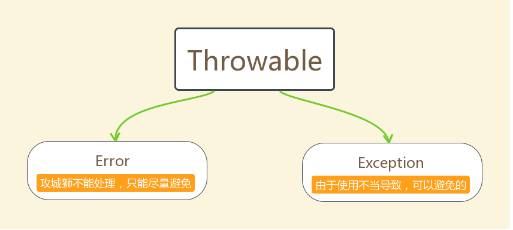

# 第一章 异常

## 1.1 异常概念

* **异常**：指的是程序在执行过程中，出现的非正常的情况，最终会导致JVM的非正常停止。

在Java等面向对象的编程语言中，异常本身是一个类，产生异常就是创建异常对象并抛出了一个异常对象。Java处理异常的方式是中断处理。

> 异常指的并不是语法错误,语法错了,编译不通过,不会产生字节码文件,根本不能运行。

## 1.2 异常体系

异常机制其实是帮助我们找到程序中的问题，异常的根类是`java.lang.Throwable`，其下有两个子类：`java.lang.Error`与`java.lang.Exception`，平常所说的异常指`java.lang.Exception`。

- 

**Throwable体系**

* **Error**：严重错误Error，无法通过处理的错误，只能事先避免。
* **Exception**:表示异常，异常产生后程序员可以通过代码的方式纠正，使程序继续运行，是必须要处理的。

**Throwable中的常用方法：**

* `public void printStackTrace()`：打印异常的详细信息。包含了异常的类型，异常的原因，异常出现的位置。
* `public String getMessage()`：获取发生异常的原因。提示给用户的时候，就提示错误原因。
* `public String toString()`：获取异常的类型和异常描述信息(不用)。

## 1.3 异常分类

**异常(Exception)的分类**

* **编译时期异常**：checked异常。在编译时期,就会检查,如果没有处理异常,则编译失败。(如日期格式化异常)
* **运行时期异常**：runtime异常。在运行时期,检查异常.在编译时期,运行异常不会编译器检测(不报错)。(如数学异常)。

- 

## 1.4 异常的处理

Java异常处理的五个关键字:**try、catch、finally、throw、throws**。

### 1.4.1 抛出异常throw

java中，提供了一个throw关键字，它用来抛出一个指定的异常对象。

1. 创建一个异常对象。封装一些提示信息(信息可以自己编写)。
2. throw**用在方法内**，用来抛出一个异常对象，将这个异常对象传递到调用者处，并结束当前方法的执行。

**格式：**

```java
throw new 异常类名(参数);
```

**示例：**

```java
throw new NullPointerException("要访问的arr数组不存在");

throw new ArrayIndexOutOfBoundsException("该索引在数组中不存在，已超出范围");
```

**示例：**

```java

```
