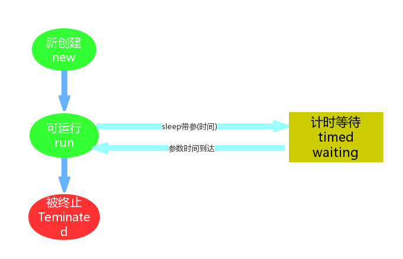

# 第八章 多线程

## 8.1 并发与并行

* **并发**：指两个或多个事件在**同一个时间段内**发生。
* **并行**：指两个或多个事件在**同一时刻**发生(同时发生)。

- 

在操作系统中，安装了多个程序，并发指的是在一段时间内宏观上有多个程序同时运行，这在单 CPU 系统中，每一时刻只能有一道程序执行，即微观上这些程序是分时的交替运行，只不过是给人的感觉是同时运行，那是因为分时交替运行的时间是非常短的。
而在多个 CPU 系统中，则这些可以并发执行的程序便可以分配到多个处理器上(CPU)，实现多任务并行执行，即利用每个处理器来处理一个可以并发执行的程序，这样多个程序便可以同时执行。目前电脑市场上说的多核CPU，便是多核处理器，核 越多，并行处理的程序越多，能大大的提高电脑运行的效率。

> Tips:
> 单核处理器的计算机肯定是不能并行的处理多个任务的，只能是多个任务在单个CPU上并发运行。同理,线程也是一样的，从宏观角度上理解线程是并行运行的，但是从微观角度上分析却是串行运行的，即一个线程一个线程的去运行，当系统只有一个CPU时，线程会以某种顺序执行多个线程，我们把这种情况称之为线程调度。

## 8.2 线程与进程

* **进程**：是指一个内存中运行的应用程序，每个进程都有一个独立的内存空间，一个应用程序可以同时运行多个进程;进程也是程序的一次执行过程，是系统运行程序的基本单位;系统运行一个程序即是一个进程从创建、运行到消亡的过程。
* **线程**：线程是进程中的一个执行单元，负责当前进程中程序的执行，一个进程中至少有一个线程。一个进程中是可以有多个线程的，这个应用程序也可以称之为多线程程序。

> 一个程序运行后至少有一个进程，一个进程中可以包含多个线程。

* **线程调度**：
  * 分时调度：所有线程轮流使用CPU的使用权，平均分配每个线程占用CPU的时间。
  * 抢占式调度：优先让优先级高的线程使用CPU，如果线程的优先级相同，那么会随机选择一个(线程随机性)，Java使用的为抢占式调度。
    * 抢占式调度详解：大部分操作系统都支持多进程并发运行，现在的操作系统几乎都支持同时运行多个程序。比如：一边使用编辑器，一边使用录屏软件，同时还开着画图板，dos窗口等软件。此时，这些程序是在同时运行，”感觉这些软件好像在同一时刻运行着“。实际上，CPU(中央处理器)使用抢占式调度模式在多个线程间进行着高速的切换。对于CPU的一个核而言，某个时刻，只能执行一个线程，而CPU的在多个线程间切换速度相对我们的感觉要快，看上去就是在同一时刻运行。 其实，多线程程序并不能提高程序的运行速度，但能够提高程序运行效率，让CPU的使用率更高。

## 8.3 创建线程类

Java使用`java.lang.Thread`类代表**线程**，所有的线程对象都必须是Thread类或其子类的实例。每个线程的作用是完成一定的任务，实际上就是执行一段程序流即一段顺序执行的代码。Java使用线程执行体来代表这段程序流。Java中通过继承Thread类来**创建**并**启动多线程**的步骤如下:

1. 定义Thread类的子类，并重写该类的run()方法，该run()方法的方法体就代表了线程需要完成的任务,因此把run()方法称为线程执行体。
2. 创建Thread子类的实例，即创建了线程对象。
3. 调用线程对象的start()方法来启动该线程。

**示例：**

```java
//自定义线程类:
public class MyThread extends Thread{

    //定义指定线程名称的构造方法
    public MyThread(String name) {
        //调用父类的String参数的构造方法，指定线程的名称
        super(name);
    }

    /**
     * 重写run方法，完成该线程执行的逻辑
     * */
    @Override
    public void run() {

        for (int i = 0; i < 10; i++) {
            System.out.println(getName()+":正在执行!"+i);
        }

    }
}
```

```java
//测试类:
public class ThreadTest {

    public static void main(String[] args) {

        MyThread thread = new MyThread("线程x号");

        //开启新线程
        thread.start();

        for (int i = 0; i < 10; i++) {
            System.out.println("main线程!"+i);
        }

    }
}
```

## 8.4 多线程原理

```java
//自定义线程类
public class MyThread extends Thread{

    public MyThread(String name) {
        super(name);
    }

    @Override
    public void run() {
        for (int i = 0; i < 20; i++) {
            System.out.println("线程："+getName()+"-->"+i);
        }
    }
}
```

```java
//测试类
public class ThreadDemo1 {

    public static void main(String[] args) {

        MyThread myThread1 = new MyThread("【小强】");

        myThread1.start();

        for (int i = 0; i < 20; i++) {
            System.out.println("线程：【旺财】-->"+i);
        }
    }
}
```

**流程图：**

- 

 程序启动运行main时候，java虚拟机启动一个进程，主线程main在main()调用时候被创建。随着调用mt的对象的start方法，另外一个新的线程也启动了，这样，整个应用就在多线程下运行。
多线程执行时，在栈内存中，**每一个执行线程都有一片自己所属的栈内存空间**。进行方法的压栈和弹栈。

- 

当执行线程的任务结束了，线程自动在栈内存中释放了。但是当所有的执行线程都结束了，那么进程就结束了。

## 8.5 Thread类

**构造方法：**

* `public Thread()`：分配一个新的线程对象。
* `public Thread(String name)`：分配一个指定名字的新的线程对象。
* `public Thread(Runnable target)`：分配一个带有指定目标新的线程对象。
* `public Thread(Runnable target,String name)`：分配一个带有指定目标新的线程对象并指定名字。

**常用方法：**

* `public String getName()`：获取当前线程名称。
* `public void start()`：导致此线程开始执行;Java虚拟机调用此线程的run方法。
* `public void run()`：此线程要执行的任务在此处定义代码。
* `public static void sleep(long millis)`：使当前正在执行的线程以指定的毫秒数暂停(暂时停止执行)。
* `public static Thread currentThread()`：返回对当前正在执行的线程对象的引用。

## 8.6 Runnable接口

1. 定义Runnable接口的实现类，并重写该接口的run()方法，该run()方法的方法体同样是该线程的线程执行体。
2. 创建Runnable实现类的实例，并以此实例作为Thread的target来创建Thread对象，该Thread对象才是真正的线程对象。
3. 调用线程对象的start()方法来启动线程。

**示例：**

```java
public class RunnableImpDemo01 implements Runnable{

    @Override
    public void run() {
        for (int i = 0; i < 20; i++) {
            System.out.println(Thread.currentThread().getName()+"-->"+i);
        }
    }
}
```

```java
public class TestDemo01 {

    public static void main(String[] args) {

        RunnableImpDemo01 runnableImpDemo01 = new RunnableImpDemo01();

        new Thread(runnableImpDemo01,"小强").start();

        for (int i = 0; i < 20; i++) {
            System.out.println("旺财"+i);
        }

        //匿名内部类的方式实现线程的创建
        new Thread(new Runnable(){

            @Override
            public void run() {
                for (int i = 0; i < 20; i++) {
                    System.out.println(Thread.currentThread().getName()+"->"+i);
                }
            }
        },"二牛").start();
    }
}
```

通过实现Runnable接口，使得该类有了多线程类的特征。run()方法是多线程程序的一个执行目标。所有的多线程代码都在run方法里面。Thread类实际上也是实现了Runnable接口的类。

在启动的多线程的时候，需要先通过Thread类的构造方法Thread(Runnable target) 构造出对象，然后调用Thread对象的start()方法来运行多线程代码。

所有的多线程代码都是通过运行Thread的start()方法来运行的。不管是继承Thread类还是实现Runnable接口来实现多线程，最终还是通过Thread的对象的API来控制线程的。

## 8.7 Callable接口

**常用方法**

* `V call()`：计算结果，如果无法计算结果，则抛出一个异常。

**示例：**

```java
public class Demo01 {

    public static void main(String[] args) throws ExecutionException, InterruptedException {

        //线程开启之后需要执行里面的call方法
        CallableDemo01 cd = new CallableDemo01();

        //可以获取线程执行完毕之后的结果.也可以作为参数传递给Thread对象
        FutureTask<String> ft = new FutureTask(cd);

        //创建线程对象
        Thread thread = new Thread(ft);

        //开启线程
        thread.start();

        String s = ft.get();
        System.out.println(s);
    }
}
```

> Tips:
>
> FutureTask中的get方法一定要放到star方法后面执行。

## 8.8 Thread、Runnable、Callable的区别

**实现Runnable、Callable接口比继承Thread类所具有的优势**：

1. 适合多个相同的程序代码的线程去共享同一个资源。
2. 可以避免java中的单继承的局限性。
3. 增加程序的健壮性，实现解耦操作，代码可以被多个线程共享，代码和线程独立。
4. 线程池只能放入实现Runable或Callable类线程，不能直接放入继承Thread的类。

> Tips:
>
> 在java中，每次程序运行至少启动2个线程。一个是main线程，一个是垃圾收集线程。因为每当使用java命令执行一个类的时候，实际上都会启动一个JVM，每一个JVM其实在就是在操作系统中启动了一个进程。

## 8.9 线程安全
### 8.9.1 线程安全

如果有多个线程在同时运行，而这些线程可能会同时运行这段代码。程序每次运行结果和单线程运行的结果是一样的，而且其他的变量的值也和预期的是一样的，就是线程安全的。

**示例：**

> 电影院要卖票，我们模拟电影院的卖票过程。假设要播放的电影是 “葫芦娃大战奥特曼”，本次电影的座位共100个(本场电影只能卖100张票)。模拟电影院的售票窗口，实现多个窗口同时卖 “葫芦娃大战奥特曼”这场电影票(多个窗口一起卖这100张票)需要窗口，采用线程对象来模拟;需要票，Runnable接口子类来模拟。

```java
//模拟票
public class Ticket implements Runnable{

    private int ticket = 100;

    /*
     * 执行卖票操作
     */
    @Override
    public void run() {
        //每个窗口卖票的操作
        // 窗口 永远开启
        while (true) {
            if (ticket > 0) {//有票 可以卖
                // 出票操作
                //使用sleep模拟一下出票时间
                try {
                    Thread.sleep(100);
                } catch (InterruptedException e) {
                    // TODO Auto‐generated catch block
                    e.printStackTrace();
                }
                //获取当前线程对象的名字
                String name = Thread.currentThread().getName();
                System.out.println(name + "正在卖:" + ticket--);
            }
        }
    }
}
```

```java
//测试类
public class Demo {

    public static void main(String[] args) {

        //创建线程任务对象
        Ticket ticket = new Ticket();

        //创建三个窗口对象
        Thread t1 = new Thread(ticket, "窗口1");
        Thread t2 = new Thread(ticket, "窗口2");
        Thread t3 = new Thread(ticket, "窗口3");

        //同时卖票
        t1.start();
        t2.start();
        t3.start();
    }
}
```

**结果：**

> 窗口2正在卖:5
> 窗口1正在卖:4
> 窗口3正在卖:3
> 窗口2正在卖:2
> 窗口3正在卖:1
> 窗口1正在卖:0
> 窗口2正在卖:-1

**程序出现了两个问题:**

1. 相同的票数,比如5这张票被卖了两回。
2. 不存在的票，比如0票与-1票，是不存在的。

这种问题，几个窗口(线程)票数不同步了，这种问题称为线程不安全。

> Tips:
> 线程安全问题都是由全局变量及静态变量引起的。若每个线程中对全局变量、静态变量只有读操作，而无写操作，一般来说，这个全局变量是线程安全的;若有多个线程同时执行写操作，一般都需要考虑线程同步，否则的话就可能影响线程安全。

### 8.9.2 线程同步

当使用多个线程访问同一资源的时候，且多个线程中对资源有写的操作，就容易出现线程安全问题。

要解决上述多线程并发访问一个资源的安全性问题:也就是解决重复票与不存在票问题，Java中提供了同步机制(**synchronized**)来解决。

根据案例简述：

> 窗口1线程进入操作的时候，窗口2和窗口3线程只能在外等着，窗口1操作结束，窗口1和窗口2和窗口3才有机会进入代码去执行。也就是说在某个线程修改共享资源的时候，其他线程不能修改该资源，等待修改完毕同步之后，才能去抢夺CPU资源，完成对应的操作，保证了数据的同步性，解决了线程不安全的现象。

**Java线程同步机制：**

1. 同步代码块。
2. 同步方法。
3. 锁机制。

### 8.9.3 同步代码块

* **同步代码块**：`synchronized`关键字可以用于方法中的某个区块中，表示只对这个区块的资源实行互斥访问。

**格式：**

```java
synchronized(同步锁){
    需要同步操作的代码
}
```

**同步锁：**

对象的同步锁只是一个概念,可以想象为在对象上标记了一个锁。

1. 锁对象 可以是任意类型。
2. 多个线程对象 要使用同一把锁。

> Tips:
> 在任何时候,最多允许一个线程拥有同步锁,谁拿到锁就进入代码块,其他的线程只能在外等着(BLOCKED)。

**示例：**

```java
public class Ticket implements Runnable{

    private int ticket = 100;

    Object lock = new Object();

    /*
     * 执行卖票操作
     */
    @Override
    public void run() {
        //每个窗口卖票的操作
        // 窗口 永远开启
        while (true) {
            synchronized (lock){
                //有票 可以卖
                if (ticket > 0) {
                    // 出票操作
                    //使用sleep模拟一下出票时间
                    try {
                        Thread.sleep(100);
                    } catch (InterruptedException e) {
                        // TODO Auto‐generated catch block
                        e.printStackTrace();
                    }
                    //获取当前线程对象的名字
                    String name = Thread.currentThread().getName();
                    System.out.println(name + "正在卖:" + ticket--);
                }else {
                    break;
                }
            }
        }
    }
}
```

### 8.9.4 同步方法

**同步方法**：使用`synchronized`修饰的方法,就叫做同步方法,保证A线程执行该方法的时候,其他线程只能在方法外等着。

**格式：**

```java
public synchronized void method(){
    可能会产生线程安全问题的代码

}
```
> 同步锁是谁？
> 对于非static方法,同步锁就是this。
> 对于static方法,使用当前方法所在类的字节码对象(类名.class)。

**示例：**

```java
public class Ticket implements Runnable {

    private int ticket = 100;

    Object lock = new Object();

    @Override
    public void run() {

        //每个窗口卖票的操作
        // 窗口 永远开启
        while (true) {
            sellTicket();
        }
    }

    public synchronized void sellTicket() {

        //有票 可以卖
        if (ticket > 0) {
            //出票操作
            //使用sleep模拟一下出票时间
            try {
                Thread.sleep(100);
            } catch (InterruptedException e) {
                // TODO Auto‐generated catch block
                e.printStackTrace();
            }
            //获取当前线程对象的名字
            String name = Thread.currentThread().getName();
            System.out.println(name + "正在卖:" + ticket--);
        }
    }
}
```

### 8.9.5 Lock锁

`java.util.concurrent.locks.Lock`机制提供了比**synchronized代码块**和**synchronized方法**更广泛的锁定操作,同步代码块/同步方法具有的功能Lock都有,除此之外更强大,更体现面向对象。

Lock锁也称同步锁，加锁与释放锁方法化：

* **public void lock()**：加同步锁。
* **public void unlock()**：释放同步锁。

**示例：**

```java
public class Ticket implements Runnable {

    private int ticket = 100;

    Lock lock = new ReentrantLock();

    @Override
    public void run() {

        //每个窗口卖票的操作
        // 窗口 永远开启
        while (true) {

            lock.lock();
            //有票 可以卖
            if (ticket > 0) {
                //出票操作
                //使用sleep模拟一下出票时间
                try {
                    Thread.sleep(100);
                } catch (InterruptedException e) {
                    // TODO Auto‐generated catch block
                    e.printStackTrace();
                }
                //获取当前线程对象的名字
                String name = Thread.currentThread().getName();
                System.out.println(name + "正在卖:" + ticket--);
            }
            lock.unlock();
        }
    }
```

## 8.10 线程状态

### 8.10.1 线程状态概述

当线程被创建并启动以后，它既不是一启动就进入了执行状态，也不是一直处于执行状态。在线程的生命周期中，在API中`java.lang.Thread.State`这个枚举中给出了六种线程状态：

| 线程状态                  | 导致状态发生条件                                                                                                                                                           |
| ------------------------- | -------------------------------------------------------------------------------------------------------------------------------------------------------------------------- |
| NEW（新建）               | 线程刚被创建，但是并未启动。还没调用start方法。                                                                                                                            |
| Runnable（可运行）        | 线程可以在java虚拟机中运行的状态，可能正在运行自己代码，也可能没有，这取决于操作系统处理器。                                                                               |
| Blocked（锁阻塞）         | 当一个线程试图获取一个对象锁，而该对象锁被其他的线程持有，则该线程进入Blocked状态;当该线程持有锁时，该线程将变成Runnable状态。                                             |
| Waiting（无限等待）       | 一个线程在等待另一个线程执行一个(唤醒)动作时，该线程进入Waiting状态。进入这个状态后是不能自动唤醒的，必须等待另一个线程调用notify或者notifyAll方法才能够唤醒。             |
| Timed Waiting（计时等待） | 同waiting状态，有几个方法有超时参数，调用他们将进入Timed Waiting状态。这一状态将一直保持到超时期满或者接收到唤醒通知。带有超时参数的常用方法有Thread.sleep 、Object.wait。 |
| Teminated（被终止）       | 因为run方法正常退出而死亡，或者因为没有捕获的异常终止了run方法而死亡。                                                                                                     |

### 8.10.2 Timed Waiting(计时等待)

Timed Waiting在API中的描述为:一个正在限时等待另一个线程执行一个(唤醒)动作的线程处于这一状态。

在我们写卖票的案例中，为了减少线程执行太快，现象不明显等问题，我们在run方法中添加了sleep语句，这样就强制当前正在执行的线程休眠(**暂停执行**)，以“减慢线程”。

当我们调用了sleep方法之后，当前执行的线程就进入到“休眠状态”，其实就是所谓的Timed Waiting(计时等待)。

```java
public class MyThread extends Thread{

    public static void main(String[] args) {
        new MyThread().start();
    }

    @Override
    public void run() {

        for (int i = 0; i < 100; i++) {

            if ((i) % 10 == 0) {
                System.out.println("\n");
                System.out.println("‐‐‐‐‐‐‐" + i);
            }

            System.out.print(i+"，");

            try {
                Thread.sleep(1);
            } catch (InterruptedException e) {
                e.printStackTrace();
            }
        }
    }
}
```

1. 进入TIMED_WAITING状态的一种常见情形是调用的 sleep 方法，单独的线程也可以调用，不一定非要有协作关系。
2. 为了让其他线程有机会执行，可以将Thread.sleep()的调用放线程run()之内。这样才能保证该线程执行过程中会睡眠。
3. sleep与锁无关，线程睡眠到期自动苏醒，并返回到Runnable(可运行)状态。

> Tips:
> sleep()中指定的时间是线程不会运行的最短时间。因此，sleep()方法不能保证该线程睡眠到期后就开始立刻执行。

- 

### 8.10.3 BLOCKED(锁阻塞)

Blocked状态在API中的介绍为:一个正在阻塞等待一个监视器锁(锁对象)的线程处于这一状态。

线程A与线程B代码中使用同一锁，如果线程A获取到锁，线程A进入到Runnable状态，那么线程B就进入到Blocked锁阻塞状态。

- 

### 8.10.4 Waiting(无限等待)

Wating状态在API中介绍为:一个正在无限期等待另一个线程执行一个特别的(唤醒)动作的线程处于这一状态。

**示例：**

```java
public class WaitingTest {

    public static Object obj = new Object();

    public static void main(String[] args) {

        // 演示waiting
        new Thread(new Runnable() {
            @Override
            public void run() {
                while (true) {
                    synchronized (obj) {
                        try {
                            System.out.println(Thread.currentThread().getName() + "=== 获取到锁对象，调用wait方法，进入waiting状态，释放锁对象");
                            obj.wait(); //无限等待
                            //obj.wait(5000); //计时等待, 5秒 时间到，自动醒来

                        } catch (InterruptedException e) {
                            e.printStackTrace();
                        }
                        System.out.println(Thread.currentThread().getName() + "=== 从waiting状态醒来，获取到锁对象，继续执行了");
                    }
                }
            }
        }, "等待线程").start();

        new Thread(new Runnable() {
            @Override
            public void run() {
//                while (true){ //每隔3秒 唤醒一次
                try {
                    System.out.println(Thread.currentThread().getName() + "‐‐‐‐‐ 等待3秒钟");
                    Thread.sleep(3000);
                } catch (InterruptedException e) {
                    e.printStackTrace();
                }

                synchronized (obj) {
                    System.out.println(Thread.currentThread().getName() + "‐‐‐‐‐ 获取到锁对象,调用notify方法，释放锁对象");
                    obj.notify();
                }
            }
        }, "唤醒线程").start();
    }
}
```

通过上述案例发现，一个调用了某个对象的Object.wait方法的线程会等待另一个线程调用此对象的
Object.notify()方法 或 Object.notifyAll()方法。

其实waiting状态并不是一个线程的操作，它体现的是多个线程间的通信，可以理解为多个线程之间的协作关系，多个线程会争取锁，同时相互之间又存在协作关系。

当多个线程协作时，比如A，B线程，如果A线程在Runnable(可运行)状态中调用了wait()方法那么A线程就进入了Waiting(无限等待)状态，同时失去了同步锁。假如这个时候B线程获取到了同步锁，在运行状态中调用了notify()方法，那么就会将无限等待的A线程唤醒。注意是唤醒，如果获取到锁对象，那么A线程唤醒后就进入Runnable(可运行)状态;如果没有获取锁对象，那么就进入到Blocked(锁阻塞状态)。

- 

### 8.10.5 线程状态图示

- 
- 
