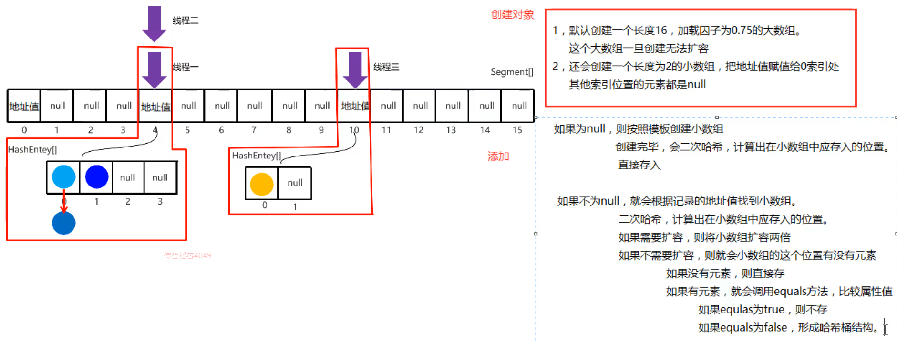
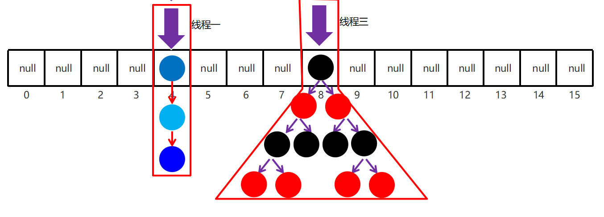

# 第一章 等待唤醒机制

## 1.1 线程间通信

**概念**：多个线程在处理同一个资源，但是处理的动作(线程的任务)却不相同。

比如：线程A用来生成包子的，线程B用来吃包子的，包子可以理解为同一资源，线程A与线程B处理的动作，一个是生产，一个是消费，那么线程A与线程B之间就存在线程通信问题。

- 

**为什么要处理线程间通信：**

多个线程并发执行时, 在默认情况下CPU是随机切换线程的，当我们需要多个线程来共同完成一件任务，并且我们希望他们有规律的执行, 那么多线程之间需要一些协调通信，以此来帮我们达到多线程共同操作一份数据。

**如何保证线程间通信有效利用资源：**

多个线程在处理同一个资源，并且任务不同时，需要线程通信来帮助解决线程之间对同一个变量的使用或操作。 就是多个线程在操作同一份数据时， 避免对同一共享变量的争夺。也就是我们需要通过一定的手段使各个线程能有效的利用资源。而这种手段即——**等待唤醒机制**。

## 1.2 等待唤醒机制

**什么是等待唤醒机制？**

这是多个线程间的一种**协作**机制。谈到线程我们经常想到的是线程间的**竞争(race)**，比如去争夺锁，但这并不是全部，线程间也会有协作机制。

就是在一个线程进行了规定操作后，就进入等待状态(**wait()**)， 等待其他线程执行完他们的指定代码过后 再将其唤醒(**notify()**);在有多个线程进行等待时， 如果需要，可以使用**notifyAll()**来唤醒所有的等待线程。

wait/notify 就是线程间的一种协作机制。

**等待唤醒中的方法**

1. wait：线程不再活动，不再参与调度，进入 wait set 中，因此不会浪费 CPU 资源，也不会去竞争锁了，这时的线程状态即是WAITING。它还要等着别的线程执行一个**特别**的动作，也即是“**通知(notify)**”在这个对象上等待的线程从wait set 中释放出来，重新进入到调度队列(ready queue)中。
2. notify：则选取所通知对象的wait set中的一个线程释放;例如，餐馆有空位置后，等候就餐最久的顾客最先入座。
3. notifyAll：则释放所通知对象的wait set上的全部线程。

> Tips:
> 哪怕只通知了一个等待的线程，被通知线程也不能立即恢复执行，因为它当初中断的地方是在同步块内，而此刻它已经不持有锁，所以她需要再次尝试去获取锁(很可能面临其它线程的竞争)，成功后才能在当初调用wait方法之后的地方恢复执行。

* 如果能获取锁，线程就从**WAITING**状态变成**RUNNABLE**状态;
* 否则，从**wait set**出来，又进入**entry set**，线程就从 **WAITING** 状态又变成**BLOCKED**状态

**调用wait和notify方法需要注意的细节：**

1. wait方法与notify方法必须要由同一个锁对象调用。因为:对应的锁对象可以通过notify唤醒使用同一个锁对象调用的wait方法后的线程。
2. wait方法与notify方法是属于Object类的方法。因为:锁对象可以是任意对象，而任意对象的所属类都是继承了Object类。
3. wait方法与notify方法必须要在同步代码块或者是同步函数中使用。因为必须要通过锁对象调用这2个方法。

## 1.3 生产者与消费者问题

等待唤醒机制其实就是经典的“生产者与消费者”的问题。

就拿生产包子消费包子来说等待唤醒机制如何有效利用资源:

> 包子铺线程生产包子，吃货线程消费包子。当包子没有时(包子状态为false)，吃货线程等待，包子铺线程生产包子 (即包子状态为true)，并通知吃货线程(解除吃货的等待状态),因为已经有包子了，那么包子铺线程进入等待状态。 接下来，吃货线程能否进一步执行则取决于锁的获取情况。如果吃货获取到锁，那么就执行吃包子动作，包子吃完(包 子状态为false)，并通知包子铺线程(解除包子铺的等待状态),吃货线程进入等待。包子铺线程能否进一步执行则取决于锁的获取情况。

**示例：**

```java
//包子资源类
public class BaoZi {

    private String Pi;
    private String Xian;
    //包子资源，是否存在，包子资源状态
    private boolean flag=false;

    public String getPi() {
        return Pi;
    }

    public void setPi(String pi) {
        Pi = pi;
    }

    public String getXian() {
        return Xian;
    }

    public void setXian(String xian) {
        Xian = xian;
    }

    public boolean isFlag() {
        return flag;
    }

    public void setFlag(boolean flag) {
        this.flag = flag;
    }
}
```

```java
//吃货线程类
public class ChiHuo extends Thread {

    private BaoZi bz;

    public ChiHuo(BaoZi bz) {
        this.bz = bz;
    }

    @Override
    public void run() {

        bz.setPi("薄皮");
        bz.setXian("白菜猪肉馅");

        while (true) {

            synchronized (bz) {

                //没包子
                if (bz.isFlag() == false) {
                    try {
                        bz.wait();
                    } catch (InterruptedException e) {
                        e.printStackTrace();
                    }
                }

                System.out.println("包子真好吃--------->");
                System.out.println("吃完了。。。。。");

                bz.setFlag(false);
                //唤醒等待线程（BaoZiPu）
                bz.notify();

            }
        }
    }
}
```

```java
//包子铺线程类
public class BaoZiPu extends Thread {

    private BaoZi bz;

    public BaoZiPu(BaoZi bz) {
        this.bz = bz;
    }

    @Override
    public void run() {

        bz.setPi("薄皮");
        bz.setXian("白菜猪肉馅");

        while (true) {

            synchronized (bz) {

                //有包子
                if (bz.isFlag() == true) {

                    try {
                        bz.wait();
                    } catch (InterruptedException e) {
                        e.printStackTrace();
                    }
                }

                System.out.println("正在制作--------->");

                try {
                    Thread.sleep(5000);
                } catch (InterruptedException e) {
                    e.printStackTrace();
                }

                System.out.println("制作好了：" + bz.getPi() + bz.getXian());

                bz.setFlag(true);
                //唤醒等待线程（ChiHuo）
                bz.notify();
            }
        }
    }
}
```

```java
//测试类
public class ThreadTest {

    public static void main(String[] args) {

        BaoZi baoZi = new BaoZi();

        new BaoZiPu(baoZi).start();
        new ChiHuo(baoZi).start();

    }
}
```

## 1.4 阻塞队列

**阻塞队列继承结构**


**常见BlockingQueue：**

ArrayBlockingQueue：底层是数组,有界。
LinkedBlockingQueue: 底层是链表,无界.但不是真正的无界,最大为int的最大值。

**BlockingQueue的核心方法：**

put(anObject)： 将参数放入队列,如果放不进去会阻塞。
take()：取出第一个数据,取不到会阻塞。

**示例：**

```java
public class QueueDemo {

    public static void main(String[] args) throws InterruptedException {

        // 创建阻塞队列的对象,容量为 1
        ArrayBlockingQueue<String> abq = new ArrayBlockingQueue(2);

        // 存储元素
        abq.put("大汉堡");

        // 取元素
        System.out.println(abq.take());
        System.out.println(abq.take());// 取不到会阻塞

        System.out.println("阻塞已结束");
    }
}
```

## 1.5 阻塞队列实现等待唤醒机制

* 生产者类(Cooker)：实现Runnable接口，重写run()方法，设置线程任务
	1. 构造方法中接收一个阻塞队列对象
	2. 在run方法中循环向阻塞队列中添加包子
* 消费者类(Foodie)：实现Runnable接口，重写run()方法，设置线程任务
	1. 构造方法中接收一个阻塞队列对象
	2. 在run方法中循环获取阻塞队列中的包子
* 测试类(Demo)：里面有main方法，main方法中的代码步骤如下
	1. 创建阻塞队列对象
	2. 创建生产者线程和消费者线程对象,构造方法中传入阻塞队列对象
	3. 分别开启两个线程

**示例：**

```java
public class Cooker implements Runnable{

    private ArrayBlockingQueue<String> abq;

    public Cooker(ArrayBlockingQueue<String> abq) {
        this.abq = abq;
    }

    @Override
    public void run() {

        while (true) {
            try {
                abq.put("肉包子");
                System.out.println("做了一个包子");
            } catch (InterruptedException e) {
                e.printStackTrace();
            }
        }
    }
}

public class Foodie implements Runnable {

    private ArrayBlockingQueue<String> abq;

    public Foodie(ArrayBlockingQueue<String> abq) {
        this.abq = abq;
    }

    @Override
    public void run() {

        while (true) {
            try {
                String str = abq.take();
                System.out.println("拿了一个"+str);
            } catch (InterruptedException e) {
                e.printStackTrace();
            }
        }
    }
}

public class Demo {

    public static void main(String[] args) {

        ArrayBlockingQueue<String> abq = new ArrayBlockingQueue<String>(1);

        Foodie foodie = new Foodie(abq);
        Cooker cooker = new Cooker(abq);

        new Thread(foodie).start();
        new Thread(cooker).start();
    }
}
```


# 第二章 线程池

## 2.1 线程池概念

* **线程池**：就是一个容纳多个线程的容器，其中的线程可以反复使用，省去了频繁创建线程对象的操作，无需反复创建线程而消耗过多资源。

- 

**合理利用线程池的优点：**

1. 降低资源消耗。减少了创建和销毁线程的次数，每个工作线程都可以被重复利用，可执行多个任务。
2. 提高响应速度。当任务到达时，任务可以不需要的等到线程创建就能立即执行。
3. 提高线程的可管理性。可以根据系统的承受能力，调整线程池中工作线线程的数目，防止因为消耗过多的内存，而把服务器累趴下(每个线程需要大约1MB内存，线程开的越多，消耗的内存也就越大，最后死机)。

## 2.3 线程池-Executors

Java里面线程池的顶级接口是`java.util.concurrent.Executor`，但是严格意义上讲`Executor`并不是一个线程池，而只是一个执行线程的工具。真正的线程池接口是`java.util.concurrent.ExecutorService`。

`java.util.concurrent.Executors`线程工厂类里面提供了一些静态工厂，生成一些常用的线程池。官方建议使用Executors工程类来创建线程池对象。

* `public static ExecutorService newFixedThreadPool(int nThreads)`：返回线程池对象。(创建的是有界线程池,也就是池中的线程个数可以指定最大数量)。

获取到了一个线程池ExecutorService对象，那么怎么使用呢，在这里定义了一个使用线程池对象的方法：

* `public Future<?> submit(Runnable task)`：获取线程池中的某一个线程对象，并执行。

> Future接口:用来记录线程任务执行完毕后产生的结果。线程池创建与使用。

使用线程池中线程对象的步骤：

1. 创建线程池对象。
2. 创建Runnable接口子类对象。(task)
3. 提交Runnable接口子类对象。(take task)
4. 关闭线程池(一般不做)。

```java
//Runnable实现类
public class MyRunnable implements Runnable{

    @Override
    public void run() {

        System.out.println("开始装逼=======》");

        try {
            Thread.sleep(1000);
        } catch (InterruptedException e) {
            e.printStackTrace();
        }

        System.out.println("装逼结束");
    }
}
```

```java
//线程池测试类
public class ThreadPoolDemo01 {

    public static void main(String[] args) {

        //创建线程池对象
        ExecutorService service = Executors.newFixedThreadPool(2);//包含2个线程对象

        service.submit(new MyRunnable());
        service.submit(new MyRunnable());
        //submit方法调用结束后，程序并不终止，是因为线程池控制了线程的关闭。

        //关闭线程池
        service.shutdown();
    }

}
```

## 2.4 线程池-ThreadPoolExecutor

```java
public ThreadPoolExecutor(int corePoolSize,
                          int maximumPoolSize,
                          long keepAliveTime,
                          TimeUnit unit,
                          BlockingQueue<Runnable> workQueue,
                          ThreadFactory threadFactory,
                          RejectedExecutionHandler handler)
```

```java
public class MyRunnable implements Runnable{

    @Override
    public void run() {
        System.out.println(Thread.currentThread().getName()+"在执行了...");
    }
}

public class PoolExecutorDemo01 {

    // 参数一:核心线程数量
    // 参数二:最大线程数
    // 参数三:空闲线程最大存活时间
    // 参数四:时间单位
    // 参数五:任务队列
    // 参数六:创建线程工厂
    // 参数七:任务的拒绝策略

    public static void main(String[] args) {

        ThreadPoolExecutor pool = new ThreadPoolExecutor(
                2,
                5,
                2,
                TimeUnit.SECONDS,
                new ArrayBlockingQueue<>(2),
                Executors.defaultThreadFactory(),
                new ThreadPoolExecutor.AbortPolicy());

        pool.submit(new MyRunnable());
        pool.submit(new MyRunnable());

        pool.shutdown();
    }
}
```


### 2.4.1 参数详解

| 参数            | 说明                                                |
| --------------- | --------------------------------------------------- |
| corePoolSize    | 核心线程数量（不能小于0）                           |
| maximumPoolSize | 最大线程数（不能小于等于0，最大数量>=核心线程数量） |
| keepAliveTime   | 空闲线程最大存活时间（不能小于0）                   |
| unit            | 时间单位                                            |
| workQueue       | 任务队列（不能为null）                              |
| threadFactory   | 创建线程工厂（不能为null）                          |
| handler         | 任务的拒绝策略（不能为null）                        |

### 2.4.2 任务拒绝策略

RejectedExecutionHandler是jdk提供的一个任务拒绝策略接口，它下面存在4个子类。

| 参数                                   | 说明                                                         |
| :------------------------------------- | ------------------------------------------------------------ |
| ThreadPoolExecutor.AbortPolicy         | 丢弃任务并抛出RejectedExecutionException异常。是默认的策略。 |
| ThreadPoolExecutor.DiscardPolicy       | 丢弃任务，但是不抛出异常 这是不推荐的做法。                  |
| ThreadPoolExecutor.DiscardOldestPolicy | 抛弃队列中等待最久的任务 然后把当前任务加入队列中。          |
| ThreadPoolExecutor.CallerRunsPolicy    | 调用任务的run()方法绕过线程池直接执行。                      |

# 第三章 原子性

**概述：**

所谓的原子性是指在一次操作或者多次操作中，要么所有的操作全部都得到了执行并且不会受到任何因素的干扰而中断，要么所有的操作都不执行，多个操作是一个不可以分割的整体。

**原子性相关问题：**

当A线程修改了共享数据时，B线程没有及时获取到最新的值，如果还在使用原先的值，就会出现问题。

1. 堆内存是唯一的，每一个线程都有自己的线程栈。
2. 每一个线程在使用堆里面变量的时候，都会先拷贝一份到变量的副本中。
3. 在线程中，每一次使用是从变量的副本中获取的。

## 3.1 volatile

**Volatile关键字：**强制线程每次在使用的时候，都会看一下共享区域最新的值。

**示例：**

```java
public class Money {

    public static volatile int money = 100000;
}

public class MyThread1 extends Thread{

    @Override
    public void run() {
        while (Money.money==100000) {

        }

        System.out.println("银行卡的钱不是100000了");
    }
}

public class MyThread2 extends Thread{

    @Override
    public void run() {

        try {
            Thread.sleep(1000);
        } catch (InterruptedException e) {
            e.printStackTrace();
        }

        Money.money = 90000;
    }
}

public class Demo {

    public static void main(String[] args) {

        MyThread1 myThread1 = new MyThread1();
        MyThread2 myThread2 = new MyThread2();

        myThread1.start();
        myThread2.start();
    }
}
```

## 3.2 synchronized关于原子性

1. 线程获得锁
2. 清空变量副本
3. 拷贝共享变量最新的值到变量副本中 
4. 执行代码
5. 将修改后变量副本中的值赋值给共享数据
6. 释放锁

```java
public class Demo {

    public static void main(String[] args) {

        MyThread1 myThread1 = new MyThread1();
        MyThread2 myThread2 = new MyThread2();

        myThread1.start();
        myThread2.start();
    }
}

public class Money {
    public static Object lock = new Object();
    public static int money = 100000;
}

public class MyThread1 extends Thread{

    @Override
    public void run() {

        while (true) {
            synchronized (Money.lock) {
                    if(Money.money!=100000) {
                        System.out.println("银行卡的钱不是100000了");
                        break;
                    }
            }
        }
    }
}

public class MyThread2 extends Thread{

    @Override
    public void run() {

        synchronized (Money.lock) {
            try {
                Thread.sleep(1000);
            } catch (InterruptedException e) {
                e.printStackTrace();
            }

            Money.money = 90000;
        }
    }
}

```


## 3.3 volatile关键字不能保证原子性

**概述：**


```java
public class MyAtomThread implements Runnable{

    private volatile int count = 0; //送冰淇淋的数量

    @Override
    public void run() {

        for (int i = 0; i < 100; i++) {
            // 1.从共享数据中读取数据到本线程栈中
            // 2.修改本线程栈中变量副本的值
            // 3.会把本线程栈中变量副本的值赋值给共享数据
            count++;
            System.out.println("已经送了" + count + "个冰淇淋");
        }

    }
}

public class AtomDemo {

    public static void main(String[] args) {
        MyAtomThread atom = new MyAtomThread();
        for (int i = 0; i < 100; i++) {
            new Thread(atom).start();
        } 
    }
}

/**
执行结果：
......
已经送了9996个冰淇淋
已经送了9997个冰淇淋
已经送了9998个冰淇淋
已经送了9999个冰淇淋
*/
```

> Tips:
>
> count++ 不是一个原子性操作, 在执行的过程中,有可能被其他线程打断。

## 3.4 Atomic

**概述：**

java从JDK1.5开始提供了java.util.concurrent.atomic包(简称Atomic包)，这个包中的原子操作类提供了一种用法简单，性能高效，线程安全地更新一个变量的方式。因为变量的类型有很多种，所以在Atomic包里一共提供了13个类，属于4种类型的原子更新方式，分别是原子更新基本类型、原子更新数组、原子更新引用和原子更新属性(字段)。

**使用原子的方式更新基本类型Atomic包提供了以下3个类：**

* AtomicBoolean： 原子更新布尔类型
* AtomicInteger： 原子更新整型
* AtomicLong： 原子更新长整型

**构造方法**

`public AtomicInteger()`：初始化一个默认值为0的原子型Integer
`public AtomicInteger(int initialValue)`：初始化一个指定值的原子型Integer

**常用方法：**

`public final int get()`：获取值
`public final int getAndIncrement()`：以原子方式将当前值加1，注意，这里返回的是自增前的值。
`public final int incrementAndGet()`：以原子方式将当前值加1，注意，这里返回的是自增后的值。
`public final int addAndGet(int delta)`：以原子方式将输入的数值与实例中的值(AtomicInteger里的value)相加，并返回结果。
`public final int getAndSet(int newValue)`：以原子方式设置为newValue的值，并返回旧值。

### 3.4.1 AtomicInteger-内存解析

**AtomicInteger原理：** 自旋锁 + CAS 算法

**CAS算法：**

有3个操作数(内存值V， 旧的预期值A，要修改的值B)
当旧的预期值A == 内存值 此时修改成功，将V改为B
当旧的预期值A!=内存值 此时修改失败，不做任何操作
并重新获取现在的最新值(这个重新获取的动作就是自旋)

### 3.4.2 AtomicInteger-案例

**示例：**

```java
public class MyAtomThread implements Runnable{

    AtomicInteger ac = new AtomicInteger(0);

    @Override
    public void run() {

        for (int i = 0; i < 100; i++) {
            // 1.从共享数据中读取数据到本线程栈中
            // 2.修改本线程栈中变量副本的值
            // 3.会把本线程栈中变量副本的值赋值给共享数据
            int count = ac.incrementAndGet();
            System.out.println("已经送了" + count + "个冰淇淋");
        }

    }
}

public class AtomDemo {

    public static void main(String[] args) {
        MyAtomThread atom = new MyAtomThread();
        for (int i = 0; i < 100; i++) {
            new Thread(atom).start();
        }
    }
}

/**
......
已经送了9997个冰淇淋
已经送了9998个冰淇淋
已经送了9999个冰淇淋
已经送了10000个冰淇淋
*/
```

## 3.5 悲观锁和乐观锁

**synchronized和CAS的区别 ：**

**相同点：**在多线程情况下，都可以保证共享数据的安全性。
**不同点：**

1. synchronized总是从最坏的角度出发，认为每次获取数据的时候，别人都有可能修改。所以在每次操作共享数据之前，都会上锁。(悲观锁)
2. CAS是从乐观的角度出发，假设每次获取数据都不会修改，所以不会上锁。只不过在修改共享数据的时候，会检查一下，有没有修改过这个数据。如果修改过，那么再次获取现在最新的值。如果没有修改过，那么现在直接修改共享数据的值。(乐观锁)

#  第四章 并发工具类

## 4.1 ConcurrentHashMap

在集合类中HashMap是比较常用的集合对象，但是HashMap是线程不安全的(多线程环境下可能会存在问题)。为了保证数据的安全性我们可以使用Hashtable，但是Hashtable的效率低下。基于以上两个原因可以使用JDK1.5以后所提供的ConcurrentHashMap。

**体系结构：**


**特点：**

1. HashMap是线程不安全的。多线程环境下会有数据安全问题
2. Hashtable是线程安全的，但是会将整张表锁起来，效率低下
3. ConcurrentHashMap也是线程安全的，效率较高。 在JDK7和JDK8中，底层原理不一样。

**示例：**

```java
public class MyConcurrentHashMapDemo {

    public static void main(String[] args) throws InterruptedException {

        //HashMap<String, String> cm = new HashMap();--使用HashMap输出的值有null值
        ConcurrentHashMap<String, String> cm = new ConcurrentHashMap();

        new Thread(() -> {
            for (int i = 0; i < 25; i++) {
                cm.put(i + "", i + "");
            }
        }).start();

        new Thread(() -> {
            for (int i = 25; i < 51; i++) {
                cm.put(i + "", i + "");
            }
        }).start();

        System.out.println("-----------------");
        Thread.sleep(1000);

        for (int i = 0; i < 51; i++) {
            System.out.println(cm.get(i+""));
        }

    }
}
```

## 4.2 ConcurrentHashMap1.7原理



## 4.3 ConcurrentHashMap1.8原理



**特点：**

1. 如果使用空参构造创建ConcurrentHashMap对象，则什么事情都不做。 在第一次添加元素的时候创建哈希表
2. 计算当前元素应存入的索引。
3. 如果该索引位置为null，则利用cas算法，将本结点添加到数组中。
4. 如果该索引位置不为null，则利用volatile关键字获得当前位置最新的结点地址，挂在他下面，变成链表。
5. 当链表的长度大于等于8时，自动转换成红黑树6，以链表或者红黑树头结点为锁对象，配合悲观锁保证多线程操作集合时数据的安全性。

## 4.4 CountDownLatch

CountDownLatch这个类能够使一个线程等待其他线程完成各自的工作后再执行。
例如，应用程序的主线程希望在负责启动框架服务的线程已经启动所有的框架服务之后再执行。

**常用方法：**

`public CountDownLatch(int count)`：参数传递线程数，表示等待线程数量，并定义了一个计数器。
`public void await()`：让线程等待，当计数器为0时，会唤醒等待的线程。
`public void countDown()`：线程执行完毕时调用，会将计数器-1。

**示例：**

```java
public class Children1 extends Thread{

    private CountDownLatch countDownLatch;

    public Children1(CountDownLatch countDownLatch) {
        this.countDownLatch = countDownLatch;
    }

    @Override
    public void run() {

        for (int i = 0; i < 10; i++) {
            System.out.println(getName()+"在吃第"+i+"个饺子");
        }

        // 线程每次调用countDown方法，计数器-1
        countDownLatch.countDown();

    }
}

public class Children2 extends Thread{

    private CountDownLatch countDownLatch;

    public Children2(CountDownLatch countDownLatch) {
        this.countDownLatch = countDownLatch;
    }

    @Override
    public void run() {

        for (int i = 0; i < 15; i++) {
            System.out.println(getName()+"在吃第"+i+"个饺子");
        }

        // 线程每次调用countDown方法，计数器-1
        countDownLatch.countDown();

    }
}

public class Children3 extends Thread{

    private CountDownLatch countDownLatch;

    public Children3(CountDownLatch countDownLatch) {
        this.countDownLatch = countDownLatch;
    }

    @Override
    public void run() {

        for (int i = 0; i < 20; i++) {
            System.out.println(getName()+"在吃第"+i+"个饺子");
        }

        // 线程每次调用countDown方法，计数器-1
        countDownLatch.countDown();

    }
}

public class MotherThread extends Thread{

    private CountDownLatch countDownLatch;

    public MotherThread(CountDownLatch countDownLatch) {
        this.countDownLatch = countDownLatch;
    }

    @Override
    public void run() {
        try {
            //当计数器变成0的时候，会自动唤醒这里等待的线程。
            countDownLatch.await();
        } catch (InterruptedException e) {
            e.printStackTrace();
        }

        System.out.println("在收拾碗筷");
    }
}

public class MyCountDownLatchDemo {

    public static void main(String[] args) {

        // 创建CountDownLatch对象并且传递给四个现场
        // 在底层定义了一个计数器，此时计数器的值就是3
        // 线程每次调用countDown方法，计数器-1
        // 当计数器变成0的时候，会自动唤醒等待的线程。
        CountDownLatch countDownLatch = new CountDownLatch(3);

        // 创建4个线程并开启
        MotherThread motherThread = new MotherThread(countDownLatch);
        motherThread.start();

        Children1 children1 = new Children1(countDownLatch);
        children1.setName("大牛");
        children1.start();

        Children2 children2 = new Children2(countDownLatch);
        children2.setName("小虎");
        children2.start();

        Children3 children3 = new Children3(countDownLatch);
        children3.setName("狗蛋");
        children3.start();

    }
}
```

## 4.5 Semaphore

Semaphore（信号量）是用来控制同时访问特定资源的线程数量，通过协调各个线程以保证合理地使用公共资源。
Semaphore通过使用计数器来控制对共享资源的访问。 如果计数器`大于0`，则允许访问。 如果为0，则拒绝访问。 计数器所计数的是允许访问共享资源的许可。 因此，要访问资源，必须从`信号量`中授予线程许可。

**常用方法：**

- `void acquire()` ：从信号量获取一个许可，如果无可用许可前将一直阻塞等待，
- `void acquire(int permits)` ：获取指定数目的许可，如果无可用许可前也将会一直阻塞等待
- `boolean tryAcquire()`：从信号量尝试获取一个许可，如果无可用许可，直接返回false，不会阻塞
- `boolean tryAcquire(int permits)`： 尝试获取指定数目的许可，如果无可用许可直接返回false
- `boolean tryAcquire(int permits, long timeout, TimeUnit unit)`：
	在指定的时间内尝试从信号量中获取许可，如果在指定的时间内获取成功，返回true，否则返回false
- `void release()`：释放一个许可，别忘了在finally中使用，注意：多次调用该方法，会使信号量的许可数增加，达到动态扩展的效果，如：初始permits为1，调用了两次release，最大许可会改变为2
- `int availablePermits()`： 获取当前信号量可用的许可

```java
public class MyRunnable implements Runnable{

    // 获得管理员对象
    private Semaphore semaphore = new Semaphore(2);

    @Override
    public void run() {
        try {
            // 获得通行证
            semaphore.acquire();
            System.out.println("获得了通行证开始行驶");

            Thread.sleep(2000);

            System.out.println("归还通行证");
            // 归还通行证
            semaphore.release();
        } catch (InterruptedException e) {
            e.printStackTrace();
        }
    }
}

public class MySemaphoreDemo {

    public static void main(String[] args) {
        MyRunnable mr = new MyRunnable();

        for (int i = 0; i < 100; i++) {
            new Thread(mr).start();
        }
    }
}

/**
获得了通行证开始行驶
获得了通行证开始行驶
归还通行证
归还通行证
获得了通行证开始行驶
获得了通行证开始行驶
归还通行证
归还通行证
......
*/
```


